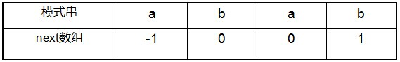
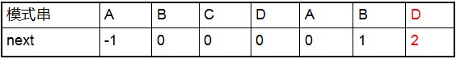

## KMP

### KMP&普通字符匹配
#### 普通字符匹配
在部分匹配到情况下出现失配的情况，目标串S会回溯到{i(当前下标) - （匹配个数） + 1}的位置，此时模式串P匹配下标回归到0的位置;


#### KMP模式匹配
在匹配过程中不会进行回溯，在适配的情况下会基于之前部分匹配的事实来继续匹配。


### KMP细节
#### next数组
next数组是用来体现当前模式串S的重复程度，next数组保存着模式串每一位所在的**前一位**前缀和后缀的最大匹配数。
例如字符串abab的对应next数组

* next的第一位永远都是-1
* 第二位"b"的前一位只有开头的"a"，因此没有有效的前后缀也就没有匹配数，next数组值为0；
* 第三位"a"的前一位后缀就是"b"，和前缀第一位"a"不同，因此也没有匹配数，next数组值为0；
* 第四位后缀"a"和第一位的前缀"a"是相同的，next数组值为1。



此时最后一位"D"的next数组对应值就是，第一位至"D"前一位的最大前后缀匹配数。这里前缀"AB"和后缀"AB"是匹配的，因此"D"对应的next数组值为2

#### next数组 & KMP
1. 在KMP模式匹配的过程中，目标串S和模式串P在部分匹配的情况下接下来发生失配S[i] != P[j]
2. 计算此次适配模式串的next数组对应的值next[j]
3. 用S[i]和P[next[j]]来匹配，如果匹配成功则继续i++，next[j]++,继续进行匹配
4. 如果匹配失败，则用S[i]和P[ next[ next[j] ] ]进行匹配，直到next的值为-1也就是匹配到模式串的开头为止，则i++，j=0

这里在匹配的情况下和普通匹配是一样的，在失配的情况下会用P[next[j]]来匹配


如上，在"D"发生失配的情况下则计算D的next数组值，这里是2。此时用模式串P[2]来继续进行匹配。在失配的情况下
找到模式串中前半部分(也就是前缀)中
和
当前失配模式串的前一位后半部分（也就是后缀）最大相同位
这里也就是2，


这里找next[j]的意思就是P[0] == P[j-2] == S[i-2], P[1] == P[j-1] == S[j-1] 但是 P[2] ！= P[j] ， P[j] ！= S[j]。
也就是说在失配的情况下模式串中开头的"AB"和模式串失配的前两位"AB"和目标串的失配的前两位"AB"是相同的，
这个时候就用模式串中找到之前的最大匹配串中的下一位来和当前失配的位置来匹配。
因此这里就用 P[2] 和之前失配的S[j]来尝试匹配，如果匹配失败来则再从"AB*"中找更短的相似串（也就是next[next[j]]）继续和目标串来匹配


#### KMP的代码实现
```
int KmpSearch(char* s, char* p)
{
	int i = 0;
	int j = 0;
	int sLen = strlen(s);
	int pLen = strlen(p);
	while (i < sLen && j < pLen)
	{
		// 如果j = -1, 也就是模式串中没有和目标串中有能匹配上的串的情况下，一般出现next递归匹配结束后
		// 当前字符匹配成功（即S[i] == P[j]）
		// 以上情况都令i++，j++ 
		if (j == -1 || s[i] == p[j])
		{
			i++;
			j++;
		}
		else
		{
			//如果j != -1，且当前字符匹配失败（即S[i] != P[j]），则令 i 不变，j = next[j]    
			//next[j]即为j所对应的next值，此时只要next[j]不为-1则尝试用这个位置继续和目标串匹配    
			j = next[j];
		}
	}
	if (j == pLen)
		return i - j;
	else
		return -1;
}

```

#### next数组 & KMP的理解
KMP匹配在失配的情况下会首先是运用next数组找出前缀中和失配位置中最大匹配的串（也就是和目标串已匹配的串相同的串），
用模式串前后最大匹配串中最后一位不匹配的就是上面例子的"ABC"中的"C"和目标串再"AB_"中的空格进行匹配，
如果不匹配在从这个最大匹配串中找一个更短匹配前缀来和目标串进行匹配。

根据上述递归，直到匹配到最大匹配串为"-1"，也就是模式串全匹配完来也没有相似的，这个时候就直接跳过到目标串的下一位i+1继续和模式串的0位置进行匹配


KMP也是一种递归的运用，在**部分匹配**的情况下寻找模式串中是否还有更短的匹配串继续和目标串匹配，既然之前完整的一部分都在失配处匹配失败了，完整的没有那就只能找更短的相似部分且最后一位不同的子串来和目标串来匹配，
这里也是运用之前匹配过的事实，因为之前都是和模式串匹配相同的前提下，因此可以模式串的前半部分和目标串是一样的，因此只要自己来计算相似的继续匹配就可以来，不用回溯。

这里next数组为什么一定要找前缀？
因为在匹配过程中都是从模式串的开头开始匹配，在模式串的后缀开始出现不匹配的，如果是从中缀中找，前面肯定有一部分是无法匹配的，因此next数组要用这种方法来进行计算。

