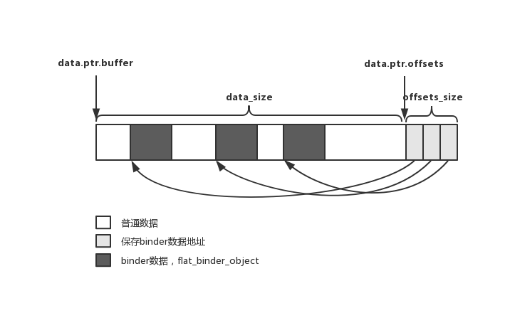
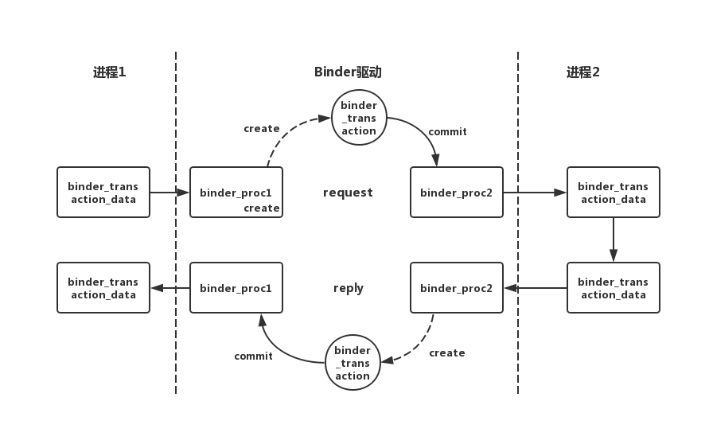
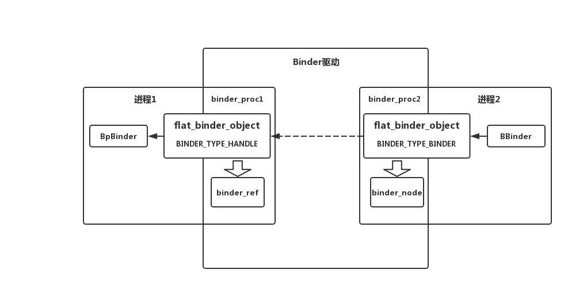
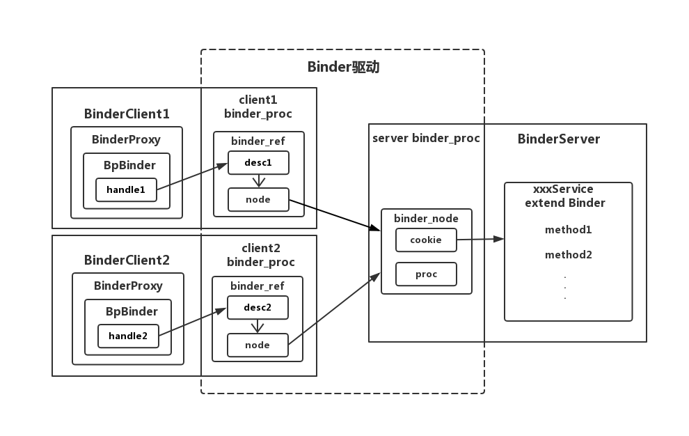

# Binder Native层通讯总结

## 提纲
> * Binder整体流程概括
> * 数据结构概括：`binder_transaction_data`、`binder_transaction`、`binder_proc`
> * Binder流程步骤说明
> * Binder流程图
> * Binder的线程管理
>   1. 默认线程数
>   2. 线程池扩充逻辑
>   3. 线程阻塞唤醒逻辑以及优化

这篇文章整理是针对大致走过一遍通讯流程的情况下整理的；目的是帮助自己在大致了解Binder通讯流程的情况下迅速回忆起里面的细节，为了方便自己阅读一些基础知识说明会被省略；


### Binder整体流程概括

### 数据结构概括
Binder请求过程中重要的数据结构一共有三个，分别是`binder_transaction_data`、`binder_transaction`、`binder_proc`这三个数据贯穿整个Binder Native层的通讯流程；

#### binder_transaction_data
用来Native层Binder驱动层通讯的Binder请求数据结构
```
struct binder_transaction_data {
	union {
		__u32 handle; //发起请求时代表binder_server的handle引用号
		binder_uintptr_t ptr; //接收请求时由驱动赋值代表BBinder的弱引用
	} target;

	binder_uintptr_t cookie; //BBinder的强引用	
	__u32 code; //调用远端服务的方法code

	binder_size_t data_size; //数据总长度（不包括记录binder偏移量的数组长度）
	binder_size_t offsets_size; //记录Binder类型数据的数组总长度 
	union {
		struct {
			binder_uintptr_t buffer; //Parcel数据所在的地址
			binder_uintptr_t offsets; //Parcel数据中记录Binder数据的数组地址
		} ptr;
	} data;
}
```
binder_transaction_data结构体中数据块和Parcel结构是一致的主要分两个，一块是用来记录数据的(data.ptr.buffer)，尾部一块是一个数组(data.ptr.offsets)，用来记录前面数据部分中的binder数据的相对地址；具体结构如下图；




#### binder_proc
描述Native层进程的结构体，保存着对应进程持有的Binder引用和Binder节点
```
struct binder_proc {
	struct hlist_node proc_node;  //进程节点
	struct rb_root threads;  //进程包含的所有线程红黑树
	struct rb_root nodes;  //binder_node红黑树节点
	struct rb_root refs_by_desc;  //binder_ref红黑树节点handle为key
	struct rb_root refs_by_node;  //binder_node红黑树节点ptr为key
	int pid;  //进程pic
	void *buffer;

	struct list_head todo;  //binder_transaction任务队列
	wait_queue_head_t wait;  //等待队列头，用于阻塞线程的
	int max_threads;  //binder线程池的最大线程数
	int requested_threads;  //正在发起添加线程的请求数，不是0就是1
	int requested_threads_started; //当前总共存在的binder线程数目
	int ready_threads; //空闲的binder线程数
}
```
#### binder_transaction
Binder线程（进程）的任务描述结构体，是进程与进程之间通讯的载体
```
struct binder_transaction {
	struct binder_work work; //列表存储的节点，用来获取binder_transaction
	struct binder_thread *from; //任务发起的线程，用于后续的唤醒等操作
	struct binder_transaction *from_parent; //记录当前任务是由哪个任务引起的，当一个任务需要多次跨进程才能完成时会出现，形成一个链表
	struct binder_proc *to_proc;  //目标进程（目标进程和线程至少有一个不为NULL）
	struct binder_thread *to_thread; //目标线程（目标进程和线程至少有一个不为NULL）
	struct binder_transaction *to_parent;  //在binder线程处理服务时赋值，记录上一次发起请求且还在等待的任务，当服务处理结束后将该字段赋值给thread继续等待用
	struct binder_buffer *buffer;//下方说明
	unsigned int	code; //对应binder_transaction_data->code
}

binder_buffer结构体主要作用是将binder_transaction_data传递到目标进程的binder_transaction_data数据体中
struct binder_buffer {
	struct binder_transaction *transaction; //所属的binder_transaction任务
	struct binder_node *target_node; //标记请求的目标binder节点
	size_t data_size; //对应binder_transaction_data->data_size
	size_t offsets_size; //对应binder_transaction_data->offsets_size
	uint8_t data[0]; //对应binder_transaction_data->data.ptr.buffer
};
```

这三个数据结构体的关系如下：




### Binder流程步骤说明
从BinderClient端的一次跨进程请求开始BpBinder调用IPCThreadState.transact方法开始，主要分为以下几步逻辑；

#### 1 组装binder_transaction_data
首先BinderClient会组装一个用于Binder请求的数据结构binder_transaction_data;
```
status_t IPCThreadState::writeTransactionData(int32_t cmd, uint32_t binderFlags,
    int32_t handle, uint32_t code, const Parcel& data, status_t* statusBuffer)
{
    binder_transaction_data tr;

    tr.target.ptr = 0;
    tr.target.handle = handle;
    tr.code = code;
    tr.flags = binderFlags;
    tr.cookie = 0;
    tr.sender_pid = 0;
    tr.sender_euid = 0;

    tr.data_size = data.ipcDataSize();//Parcel数据长度
    tr.data.ptr.buffer = data.ipcData();//Parcel数据的起始地址
    tr.offsets_size = data.ipcObjectsCount()*sizeof(binder_size_t);//Binder数据偏移量数组总长度
    tr.data.ptr.offsets = data.ipcObjects();//Binder数据偏移量数组地址

    mOut.writeInt32(cmd);//写入BC_TRANSACTION
    mOut.write(&tr, sizeof(tr));写入binder_transaction_data

    return NO_ERROR;
}
```
需要注意的是请求将BpBinder传递过来的handle引用号赋值给了binder_transaction_data.target.handle变量上，用于告诉驱动本次请求的BinderServer，方便驱动分配任务;

#### 2 调用ioctl陷入内核层
组装完成binder_transaction_data后会统一根据协议写入到binder_write_read结构体中
```
status_t IPCThreadState::talkWithDriver(bool doReceive)
{
	binder_write_read bwr;
	bwr.write_size = outAvail;//数据长度(size[cmd + binder_transaction_data])
    bwr.write_buffer = (uintptr_t)mOut.data();//数据(cmd + binder_transaction_data)
	bwr.read_size = mIn.dataCapacity();//默认256
    bwr.read_buffer = (uintptr_t)mIn.data();//空

	...
	ioctl(mProcess->mDriverFD, BINDER_WRITE_READ, &bwr)
	...
}
```
这里将cmd和binder_transaction_data根据协议传给binder_write_read结构体接着调用ioctl进入内核态；

#### 3 驱动层解析binder_transaction_data，找到Server进程
```
static void binder_transaction(struct binder_proc *proc,
			       struct binder_thread *thread,
			       struct binder_transaction_data *tr, int reply)
{
	//读取到BinderClient传递过来的binder_transaction_data
	if (tr->target.handle) {
		struct binder_ref *ref;
		//尝试在自己的进程描述体中找到BinderServer对应的binder引用
		ref = binder_get_ref(proc, tr->target.handle, true);
		//通过binder引用找到binder节点
		target_node = ref->node;
	}	
	//找到节点中记录的BinderServer所在的进程描述体
	target_proc = target_node->proc;
	...
}
```
在向目标Binder发送请求前提必然是已经获取过这个BinderServer的引用，如果进程曾经获取过相应的Binder引用，内核就会以binder_ref的形式将BinderServer对应的引用记录在请求进程的描述体binder_proc中，并且会生成一个对应的handle给上层做映射用。

当上层发起请求时引用获取的顺序handle->binder_ref->binder_node最后获取到binder_node所在的进程binder_proc后续要给进程提交任务；


#### 4 组装binder_transaction任务提交到Server进程任务队列中
在找到BinderServer进程后就会将本次请求封装成一个binder_transaction任务提交到BinderServer进程任务队列中，来唤醒BinderServer进程中的其中一个线程来处理
```
static void binder_transaction(struct binder_proc *proc,
			       struct binder_thread *thread,

			       struct binder_transaction_data *tr, int reply)
{
	struct binder_transaction *t;
	...

	t->from = thread; //记录当前任务来自哪个BinderClient线程
	t->to_proc = target_proc; //BinderServer所在的进程
	t->to_thread = target_thread;//在请求过程中大部分时间为null，优化复用是才会有值
	t->code = tr->code;//调用BinderServer的方法code
	
	//在目标进程对应的mmap内存映射空间申请一段存放参数的内容
	t->buffer = binder_alloc_buf(target_proc, tr->data_size,
		tr->offsets_size, !reply && (t->flags & TF_ONE_WAY));
	t->buffer->target_node = target_node;//记录BinderServer对应的节点

	//从BinderClient进程拷贝数据到BinderServer的mmap映射内存
	if (copy_from_user(t->buffer->data, (const void __user *)(uintptr_t)
			   tr->data.ptr.buffer, tr->data_size)) {
		return_error = BR_FAILED_REPLY;
		goto err_copy_data_failed;
	}
	t->from_parent = thread->transaction_stack;//优化重用等待线程优化用
	thread->transaction_stack = t;//标记当前线程正在等待的任务
	t->work.type = BINDER_WORK_TRANSACTION;

		target_list = &target_proc->todo;
		target_wait = &target_proc->wait;

	list_add_tail(&t->work.entry, target_list);//将任务提交到目标进程的任务队列中
	wake_up_interruptible(target_wait);//唤醒目标进程中的某个线程
	...
}
```
注意这里的work.type是`BINDER_WORK_TRANSACTION`；

#### 5 BinderClient进入阻塞状态等待BinderServer进程返回结果
BinderClient在提交完任务后会将提交任务的结果返回给Native层而后根据是否需要返回结果来判断受否进入阻塞状态，如果当前请求的是需要返回结果（reply不会null）的方法，则会进入阻塞状态去等待结果的返回；

```
status_t IPCThreadState::waitForResponse(Parcel *reply, status_t *acquireResult)
{
    uint32_t cmd;
    int32_t err;

    while (1) {
		//请求结果返回处
		if ((err=talkWithDriver()) < NO_ERROR) break;
		//读取在提交任务完成时驱动返回的命令
		cmd = (uint32_t)mIn.readInt32();
        switch (cmd) {
        case BR_TRANSACTION_COMPLETE:
			//如果不需要返回结果的情况下会直接finish返回退出循环
			//否则会继续进入循环去尝试读取数据然后进入阻塞
            if (!reply && !acquireResult) goto finish;
            break;
	}
}		

```
假设当前请求是需要返回结果的就会再次进入驱动层尝试读取返回结果
```
static int binder_thread_read(struct binder_proc *proc,
			      struct binder_thread *thread,
			      binder_uintptr_t binder_buffer, size_t size,
			      binder_size_t *consumed, int non_block)
{
	//当前线程没任务或者对应的任务队列是NULL则会阻塞等待请求任务
	//而当前线程是存在一个待完成的任务（transaction_stack != NULL），所以是false
	//这个变量更多的是作用在BinderServer进程标记是否需要阻塞等待新的任务到来
	int wait_for_proc_work = thread->transaction_stack == NULL &&
				list_empty(&thread->todo);

	if (wait_for_proc_work) {
		...
	} else {
		//阻塞进入等待状态
		//binder_has_thread_work判断的条件是todo任务队列中是否有任务
		//这里没有任务，所以进入阻塞抓过你太
		ret = wait_event_freezable(thread->wait, binder_has_thread_work(thread));
}
```

#### 6 BinderServer进程的其中一个线程唤醒并解析`binder_transaction`任务
BinderServer的工作线程默认在没有任务的时候会通过wait_event_freezable_exclusive函数阻塞着等待任务的分配；
```
static int binder_thread_read(struct binder_proc *proc,
			      struct binder_thread *thread,
			      binder_uintptr_t binder_buffer, size_t size,
			      binder_size_t *consumed, int non_block)
{
	if (wait_for_proc_work) {
		//此时其中一个以进程等待队列头阻塞的线程被唤醒
		ret = wait_event_freezable_exclusive(proc->wait, binder_has_proc_work(proc, thread));
	}

	//从进程任务队列中获取一个任务
	if (!list_empty(&proc->todo) && wait_for_proc_work)
			w = list_first_entry(&proc->todo, struct binder_work, entry);

	switch (w->type) {
		//BinderClient添加的任务类型是BINDER_WORK_TRANSACTION
		case BINDER_WORK_TRANSACTION: {
			//从entry中重新获取到加入的binder_transaction
			t = container_of(w, struct binder_transaction, work);
		} break;
	}	

	//检查是否有目标BinderServer节点，有就说明是请求时BinderServer处理的任务
	//没有就说明是BinderClient线程被唤醒时用于返回数据的任务
	//因此这里返回的cmd就是BR_TRANSACTION
	if (t->buffer->target_node) {
		//开始拼装给BinderServer进程用的binder_transaction_data数据体
		struct binder_node *target_node = t->buffer->target_node;
		tr.target.ptr = target_node->ptr;//记录目标Server的弱引用
		tr.cookie =  target_node->cookie; //记录目标BinderServer的引用
		cmd = BR_TRANSACTION;
	}else {
			tr.target.ptr = 0;
			tr.cookie = 0;
			cmd = BR_REPLY;
	}
	tr.code = t->code;//赋值请求方法code

	//下面是把之前的BinderClient端binder_transaction_data传给binder_transaction又重新转成
	//BinderServer所需要的binder_transaction_data中
	tr.data_size = t->buffer->data_size;
	tr.offsets_size = t->buffer->offsets_size;
	tr.data.ptr.buffer = (binder_uintptr_t)(
				(uintptr_t)t->buffer->data +
				proc->user_buffer_offset);
	tr.data.ptr.offsets = tr.data.ptr.buffer +
				ALIGN(t->buffer->data_size,
					sizeof(void *));

	//将cmd BR_TRANSACTION和binder_transaction_data写回到BinderServer所在的用户进程
	if (put_user(cmd, (uint32_t __user *)ptr))
		return -EFAULT;
	ptr += sizeof(uint32_t);
	if (copy_to_user(ptr, &tr, sizeof(tr)))
		return -EFAULT;
}
```
总结一下，BinderServer线程被唤醒后确定了`cmd=BR_TRANSACTION`并且封装了`binder_transaction_data`将这个数据写入到BinderServer在Native曾传入的`binder_write_read.read_buffer`中，注意这里`tr.target.ptr`就是目标BinderServer对应的BBinder对象，里面保存着java层Binder的引用，BBinder的引用是从Java层Binder->JavaBBinder->flat_binder_object->binder_node一步一步存到内核，然后又一步步的从内核被返回给上层来处理任务；

#### 7 BinderServer获取BBinder(JavaBBinder)处理请求

```
status_t IPCThreadState::executeCommand(int32_t cmd) {
	switch ((uint32_t)cmd) {
		case BR_TRANSACTION:
        {
			//读取驱动层返回的binder_transaction_data数据
            binder_transaction_data tr;
            result = mIn.read(&tr, sizeof(tr));
           
		    //将驱动层的数据读取并创建一个Parcel对象
            Parcel buffer;
            buffer.ipcSetDataReference(
                reinterpret_cast<const uint8_t*>(tr.data.ptr.buffer),
                tr.data_size,
                reinterpret_cast<const binder_size_t*>(tr.data.ptr.offsets),
                tr.offsets_size/sizeof(binder_size_t), freeBuffer, this);

            Parcel reply;
            status_t error;
          
            if (tr.target.ptr) {         
                if (reinterpret_cast<RefBase::weakref_type*>(
                        tr.target.ptr)->attemptIncStrong(this)) {

					//取出cookie中保存的JavaBBinder引用调用transact方法
					//接着调用Java层Binder.onTransact
                    error = reinterpret_cast<BBinder*>(tr.cookie)->transact(tr.code, 
						buffer, &reply, tr.flags);
                    reinterpret_cast<BBinder*>(tr.cookie)->decStrong(this);
                } else {
                    error = UNKNOWN_TRANSACTION;
                }

            }
			//将处理结果返回给BinderClient进程
            sendReply(reply, 0);
        }
        break;
	}
}
```
BinderServer从内核态返回到用户态在Native层读取了驱动层返回的cmd以及binder_transaction_data数据后拼装成一个Parcel数据，取出Binder(JavaBBinder)引用间接通过`mObject`保存的java层Binder来调用`onTransact`方法来处理业务。处理完成后将结果写入到reply中然后再通过驱动将结果返回给BinderClient

#### 8 获取返回结果并且返回给驱动层
```
status_t IPCThreadState::sendReply(const Parcel& reply, uint32_t flags)
{
    status_t err;
    status_t statusBuffer;
    err = writeTransactionData(BC_REPLY, flags, -1, 0, reply, &statusBuffer);
    if (err < NO_ERROR) return err;

    return waitForResponse(NULL, NULL);
}
```
之前处理完成后会调用`sendReply`方法，这里需要注意的是此时，因为是返回给请求的进程所以不需要指定请求Binder的handle引用号和请求的方法编号coded的；写入的数据全部分解存到`binder_transaction_data`中
```
	tr.data_size = data.ipcDataSize();
	tr.data.ptr.buffer = data.ipcData();
	tr.offsets_size = data.ipcObjectsCount()*sizeof(binder_size_t);
	tr.data.ptr.offsets = data.ipcObjects();
```
最后通过ioctl方法将`BC_REPLY`和`binder_transaction_data`写入到`binder_write_read`中并去请求内核区的Binder驱动；

#### 9 唤醒BinderClinet线程并返回结果
```
static void binder_transaction(struct binder_proc *proc,
			       struct binder_thread *thread,
			       struct binder_transaction_data *tr, int reply,
			       binder_size_t extra_buffers_size)
{
	if (reply) {
		//从BinderServer处理线程中保存的binder_transaction任务
		in_reply_to = thread->transaction_stack;
		
		//找到BinderClient的请求线程
		target_thread = in_reply_to->from;
		//找到BinderClient的请求进程
		target_proc = target_thread->proc;
	}

	if (target_thread) {
		target_list = &target_thread->todo; //找到之前阻塞的BinderClient线程的任务列表
		target_wait = &target_thread->wait; //找到之前阻塞的BinderClient线程的等待队列用于唤醒
	}

	//创建一个binder_transaction任务
	struct binder_transaction *t;
	t->to_proc = target_proc; 
	t->to_thread = target_thread;
	t->buffer->target_node = target_node; //这里是NULL，只有在请求时才会有值

	//在BinderClient进程的mmap映射内存中申请一段内存用于写入BinderServer返回的数据
	t->buffer = binder_alloc_buf(target_proc, tr->data_size,
		tr->offsets_size, extra_buffers_size,
		!reply && (t->flags & TF_ONE_WAY));

	t->buffer->transaction = t;
	t->buffer->target_node = target_node; //null

	//将BinderServer返回的数据写入到BinderClinet的mmap映射内存中
	if (copy_from_user_preempt_disabled(t->buffer->data, (const void __user *)(uintptr_t)
			   tr->data.ptr.buffer, tr->data_size)) {
		return_error = BR_FAILED_REPLY;
		goto err_copy_data_failed;
	}
	t->work.type = BINDER_WORK_TRANSACTION;

	//将任务添加到BinderClient所在的任务列表中
	list_add_tail(&t->work.entry, target_list);
	if (reply || !(t->flags & TF_ONE_WAY)) {

		//唤醒之前等待请求结果阻塞的BinderClient线程
		wake_up_interruptible_sync(target_wait);
	}
}
```
驱动从BinderServer处理线程的描述体`thread->transaction_stack`中获取到之前正在处理的任务然后获取到之前阻塞的BinderClinet线程，创建binder_transaction任务添加到BinderClient线程的任务队列中并且唤醒；此后BinderServer因队列中没有任务会在`binder_thread_read`函数中进入到阻塞状态，等待下次唤醒并处理任务；

#### 10 BinderClient被唤醒返回结果到Native层
```
static int binder_thread_read(struct binder_proc *proc,
			      struct binder_thread *thread,
			      binder_uintptr_t binder_buffer, size_t size,
			      binder_size_t *consumed, int non_block)
{
	//从此处唤醒（阻塞条件是thread->todo任务队列为空
	//且thread->transaction_stack任务栈记录有正在处理的任务）
	ret = wait_event_freezable(thread->wait, binder_has_thread_work(thread));

	while (1) {
		uint32_t cmd;
		struct binder_transaction_data tr;
		struct binder_work *w;
		struct binder_transaction *t = NULL;

	w = list_first_entry(&thread->todo, struct binder_work, entry);

	switch (w->type) {
		case BINDER_WORK_TRANSACTION: {
			t = container_of(w, struct binder_transaction, work);
		} break;
	}

	//这里是NULL到else块
	if (t->buffer->target_node) {
		...
	} else {
		tr.target.ptr = 0;
		tr.cookie = 0;
		cmd = BR_REPLY;
	}

	//下面重新将binder_transaction中的数据又拼回城binder_transaction_data
	tr.data_size = t->buffer->data_size;
	tr.offsets_size = t->buffer->offsets_size;
	tr.data.ptr.buffer = (binder_uintptr_t)(
				(uintptr_t)t->buffer->data +
				proc->user_buffer_offset);
	tr.data.ptr.offsets = tr.data.ptr.buffer +
				ALIGN(t->buffer->data_size,
					sizeof(void *));

	//将cmd 和 binder_transaction_data数据写回到BinderClient传入的binder_write_read中去
	if (put_user_preempt_disabled(cmd, (uint32_t __user *)ptr))
		return -EFAULT;
	if (copy_to_user_preempt_disabled(ptr, &tr, sizeof(tr)))
		return -EFAULT;
}	
```
BinderClient在之前等待返回结果时阻塞在`wait_event_freezable`函数中，此时被BinderServer线程唤醒来处理返回姐的`binder_transaction`任务，最后组装了一个cmd和`binder_transaction_data`返回给上层；需要注意的是因为是返回结果阶段，BinderServer在binder_thread_write阶段创建的binder_transaction中并没有target_node，因此这里确定返回的数据中`cmd=BR_REPLY`；

#### 11 BinderClient的Native层读取返回结果
```
status_t IPCThreadState::waitForResponse(Parcel *reply, status_t *acquireResult)
{

	uint32_t cmd;

    while (1) {
        if ((err=talkWithDriver()) < NO_ERROR) break;

        cmd = (uint32_t)mIn.readInt32();

        switch (cmd) {
			case BR_REPLY:
				{
					binder_transaction_data tr;
					err = mIn.read(&tr, sizeof(tr));
					//读取返回的数据重新组装reply（Parcel）对象
					reply->ipcSetDataReference(
						reinterpret_cast<const uint8_t*>(tr.data.ptr.buffer),
						tr.data_size,
						reinterpret_cast<const binder_size_t*>(tr.data.ptr.offsets),
						tr.offsets_size/sizeof(binder_size_t),
						freeBuffer, this);
				}
		}
	}
}
```
根据cmd处理返回的数据拼装成一个Parcel数据通过BpBinder接着返回给Java层，至此一次Binder通讯过程完成；

### 内核区各进程Binder节点管理
在Binder通讯过程中，驱动会检查每次通讯过程中是否存在Binder类型的数据，这里包括代表BinderServer的BBinder类型的和代表BinderProxy的BpBinder类型的数据；

在通讯过程中如果发现了通讯数据，也就是binder_transaction_data中包含了Binder数据驱动就会检查对应的`binder_proc`中是否已经存在对应的描述体，如果不存在则会创建；

假如进程1打算通过Parcel将一个Binder数据传递到进程2，此时驱动会为进程1对应的binder_proc创建一个binder_node节点为进程2创建一个binder_ref引用;

#### BBinder在Parcel中的表现
根据源码Java层的Binder和BinderProxy对应的Native层的BBinder和BpBinder，而到Native层中为了把BBinder和BpBinde写入到Parcel中会将BBinder和BpBinder转化成一个`flat_binder_object`
```
status_t Parcel::writeStrongBinder(const sp<IBinder>& val)
{
    return flatten_binder(ProcessState::self(), val, this);
}
```
```
status_t flatten_binder(const sp<ProcessState>& /*proc*/,
    const sp<IBinder>& binder, Parcel* out)
{
    flat_binder_object obj;

    if (binder != NULL) {
        IBinder *local = binder->localBinder();
		//能够通过localBinder函数返回自身实例的说明是BBinder否则就是BpBinder
        if (!local) {
			BpBinder *proxy = binder->remoteBinder();
            const int32_t handle = proxy ? proxy->handle() : 0;
            obj.hdr.type = BINDER_TYPE_HANDLE;//记录类型
            obj.binder = 0; 
            obj.handle = handle; //记录引用号
            obj.cookie = 0;
        } else {
            obj.hdr.type = BINDER_TYPE_BINDER;//记录类型
            obj.binder = reinterpret_cast<uintptr_t>(local->getWeakRefs());//记录弱引用
            obj.cookie = reinterpret_cast<uintptr_t>(local);//记录强引用
        }
    }
    return finish_flatten_binder(binder, obj, out);
}
```
需要注意的是BBinder会写入Parcel时转为`flat_binder_object`结构体，这里有三个关键变量
* **flat_binder_object.type**为`BINDER_TYPE_BINDER`代表当前的Binder数据类型是一个BinderServer
* **flat_binder_object.binder**为BBinder的一个弱引用
* **flat_binder_object.cookie**为BBinder的引用

BpBinder会写入Parcel时转为`flat_binder_object`结构体，其中有两个关键变量
* **flat_binder_object.type**为`BINDER_TYPE_HANDLE`代表当前的Binder数据类型是一个BinderProxy代理
* **flat_binder_object.handle**为BinderProxy的引用号

#### BBinder在驱动层中的缓存逻辑
而上述的这个数据结构会被写入到`binder_transaction_data`中然后传入到Binder驱动中，而在通讯过程中的Binder驱动层`binder_transaction`函数中回去扫描`binder_transaction_data`中的数据
```
static void binder_transaction(struct binder_proc *proc,
			       struct binder_thread *thread,
			       struct binder_transaction_data *tr, int reply)
{
	//读取binder_transaction_data中的数据
	if (copy_from_user(t->buffer->data, (const void __user *)(uintptr_t)
			   tr->data.ptr.buffer, tr->data_size)) {
		goto err_copy_data_failed;
	}
	//读取binder_transaction_data中记录Binder数据的数组
	if (copy_from_user(offp, (const void __user *)(uintptr_t)
			   tr->data.ptr.offsets, tr->offsets_size)) {
		goto err_copy_data_failed;
	}
}
```
这里的binder_transaction_data中的数据存储结构如下


这里先读取存储的数据，也就是图里的`data_size`长度的这块数据，而这块数据中灰色部分就是代表缓存的`flat_binder_object`，而想要把这些`flat_binder_object`从数据中找出来就需要通过后面的偏移量数组了；

这个偏移量数组（`offsets_size`长度标记的数据块）中记录着每个`flat_binder_object`的位置，通过这个数组中记录的位置就可以把数据中的binder类型数据挑选出来；

```
//offp：binder数据偏移量数组的起始位置
//tr->offsets_size：binder数据偏移量数组的长度
//t->buffer->data：binder_transaction_data中保存的Parcel所有数据的地址，包括binder以及非binder的数据
//t->buffer->data_size：binder_transaction_data中保存的Parcel所有数据的长度

off_end = (void *)offp + tr->offsets_size; //binder数据偏移量数组的末尾
off_min = 0; //记录上次flat_binder_object的末尾地址
for (; offp < off_end; offp++) {
		struct flat_binder_object *fp;
		if (*offp > t->buffer->data_size - sizeof(*fp) ||  //如果offp记录的binder数据地址到整个数据的结尾大于一个flat_binder_object，说明越界了有问题
		    *offp < off_min || //如果当前offp记录的binder数据地址小于上一个binder数据的末尾，说明重叠了有问题
		    t->buffer->data_size < sizeof(*fp) || //数据的总长度还没有一个flat_binder_object的大小大，说明有问题
		    !IS_ALIGNED(*offp, sizeof(u32))) {
			//直接报错返回
			return_error = BR_FAILED_REPLY;
			goto err_bad_offset;
		}
		//更新下一个binder的数据所在的地址
		fp = (struct flat_binder_object *)(t->buffer->data + *offp);
		//记录本次binder数据的末尾地址
		off_min = *offp + sizeof(struct flat_binder_object);

		switch (fp->type) {
		//如果是BBinder的处理逻辑
		case BINDER_TYPE_BINDER:
		case BINDER_TYPE_WEAK_BINDER: {
			struct binder_ref *ref;
			//在当前binder_proc中查找是否之气那已经记录过
			struct binder_node *node = binder_get_node(proc, fp->binder);
			//如果没有则会创建一个binder_node代表BBinder保存到proc中
            if (node == NULL) {
				node = binder_new_node(proc, fp->binder, fp->cookie);
			}
			//接着为请求的进程（收到这个Binder数据的进程），创建一个binder_ref引用
			ref = binder_get_ref_for_node(target_proc, node);
		
			//修改类型将BBinder类型修改为BpBinder类型，让获取方在读取时将这个Binder数据解释成一个BinderProxy
        	if (fp->type == BINDER_TYPE_BINDER)
				fp->type = BINDER_TYPE_HANDLE;
			else
				fp->type = BINDER_TYPE_WEAK_HANDLE;
			fp->binder = 0;
			fp->handle = ref->desc;//为获取方在翻译生成BpBinder时保存引用号
			fp->cookie = 0;
			binder_inc_ref(ref, fp->type == BINDER_TYPE_HANDLE,
				       &thread->todo);
		} break;
		
		//如果是BpBinder的处理逻辑
		case BINDER_TYPE_HANDLE:
		case BINDER_TYPE_WEAK_HANDLE: {
		  struct binder_ref *ref = binder_get_ref(proc, fp->handle,
						fp->type == BINDER_TYPE_HANDLE);
			//如果这个BpBinder的获取方本身就存在对应的BBinder对象
			//则将BINDER_TYPE_HANDLE类型的flat_binder_object转换成一个BINDER_TYPE_BINDER
			if (ref->node->proc == target_proc) {
				if (fp->type == BINDER_TYPE_HANDLE)
					fp->type = BINDER_TYPE_BINDER;
				else
					fp->type = BINDER_TYPE_WEAK_BINDER;
				fp->binder = ref->node->ptr;
				fp->cookie = ref->node->cookie;
				binder_inc_node(ref->node, fp->type == BINDER_TYPE_BINDER, 0, NULL);
			} else {
				//继续为获取方进程创建一个binder_ref
				struct binder_ref *new_ref;
				new_ref = binder_get_ref_for_node(target_proc, ref->node);
				fp->binder = 0;
				fp->handle = new_ref->desc;//为获取方在翻译生成BpBinder时保存引用号
				fp->cookie = 0;
				binder_inc_ref(new_ref, fp->type == BINDER_TYPE_HANDLE, NULL);
			}
		} break;
}
```
从上面代码中可以得出以下结论
 * 1. BBinder对应的`flat_binder_object`在经过驱动层后都会被翻译成type为BINDER_TYPE_HANDLE的`flat_binder_object`
 * 2. BpBinder对应的`flat_binder_object`在经过驱动层后只有目标进程是BpBinder对应的BBinder所在的进程才会被转换成BINDER_TYPE_BINDER的`flat_binder_object`
 * 3. 在经过驱动层后，驱动会为BBinder的提供方进程创建`binder_node`，为获取方进程创建`binder_ref`，以记录进程中binder对象的获取情况，避免了非法调用（只有在获取过才能调用）



注意：同一个BBinder在不同binder_proc生成的binder_ref的引用号handle是不同的，每个进程都会以自增的形式记录这个引用号

当通过获取到BinderServer提供的Binder代理对象发起请求时具体流程如下图



### Binder的启动及线程管理
#### Binder的启动
Android应用进程默认都是由Zygote进程fork出来并且调用ActivityThread的main函数来进行初始化工作的，而在进程fork完成后就会对Binder进行初始化操作；
```
    Runnable processOneCommand(ZygoteServer zygoteServer) {
		...
        fd = null;
		//调用底层fork函数来创建进程
        pid = Zygote.forkAndSpecialize(parsedArgs.uid, parsedArgs.gid, parsedArgs.gids,
                parsedArgs.runtimeFlags, rlimits, parsedArgs.mountExternal, parsedArgs.seInfo,
                parsedArgs.niceName, fdsToClose, fdsToIgnore, parsedArgs.instructionSet,
                parsedArgs.appDataDir);

            if (pid == 0) {
                // 进程创建之后pid为0代表是子进程
                zygoteServer.setForkChild();

                zygoteServer.closeServerSocket();
                IoUtils.closeQuietly(serverPipeFd);
                serverPipeFd = null;

                return handleChildProc(parsedArgs, descriptors, childPipeFd);
            } else {
              ...
            }
    }

    private Runnable handleChildProc(Arguments parsedArgs, FileDescriptor[] descriptors,
            FileDescriptor pipeFd) {
		...		
            return ZygoteInit.zygoteInit(parsedArgs.targetSdkVersion, parsedArgs.remainingArgs,
                    null /* classLoader */);
    }
```	
Zygote在接收到fork请求时会调用`processOneCommand`方法来处理任务，最后调用`ZygoteInit.zygoteInit`对进程进行初始化；最后会来到JNI层的`com_android_internal_os_ZygoteInit_nativeZygoteInit`函数
```
static void com_android_internal_os_ZygoteInit_nativeZygoteInit(JNIEnv* env, jobject clazz)
{
    gCurRuntime->onZygoteInit();
}
```
这里`gCurRuntime`的实例是`AppRuntime`，最后会来到`AppRuntime::onZygoteInit`函数，
```
    virtual void onZygoteInit()
    {
		//初始化ProcessState对象
        sp<ProcessState> proc = ProcessState::self();
        proc->startThreadPool();
    }
```
`onZygoteInit`函数负责初始化`ProcessState`创建单例对象；
```
sp<ProcessState> ProcessState::initWithDriver(const char* driver)
{
    Mutex::Autolock _l(gProcessMutex);
    if (gProcess != NULL) {
		//如果存在实例则直接返回
        if (!strcmp(gProcess->getDriverName().c_str(), driver)) {
            return gProcess;
        }
    }
	//如果不存在实例则创建实例
    gProcess = new ProcessState(driver);
    return gProcess;
}

ProcessState::ProcessState(const char *driver)
    : mDriverName(String8(driver))
    , mDriverFD(open_driver(driver)) //打开Binder驱动
  	...
{
    if (mDriverFD >= 0) {
		//进行mmap内存映射
        mVMStart = mmap(0, BINDER_VM_SIZE, PROT_READ, MAP_PRIVATE | MAP_NORESERVE, mDriverFD, 0);
   		...
    }
}

static int open_driver(const char *driver)
{
    int fd = open(driver, O_RDWR | O_CLOEXEC);
    if (fd >= 0) {
        ...
        size_t maxThreads = DEFAULT_MAX_BINDER_THREADS;
        result = ioctl(fd, BINDER_SET_MAX_THREADS, &maxThreads);
    }
    return fd;
}
```
`ProcessState`在创建过程中会进行如下步骤:

1. 打开Binder驱动
2. 设置最大Binder线程数，默认是15个
3. 进行mmap映射

总结：App进程在完成fork后执行ActivityThread的main方法之前会进行一次初始化，在初始化过程中会对当前进程的ProcessState进行配置，Binder的最大处理线程数默认配置是15个；

#### 线程池扩充逻辑
Binder驱动中开始一般不会创建最大值（默认15个）的线程数来阻塞等待任务的分配，当需要扩充等待分配任务的线程时一般都是通过驱动来告诉上层创建线程然后请求驱动阻塞来等待任务的分配；而检查是否需要增加线程是驱动中每次BinderServer线程获取到任务准备返回处理时（也就是每次消耗了一个空闲线程时），具体位置是在`binder_thread_read`函数中，代码逻辑如下
```
static int binder_thread_read(struct binder_proc *proc,
			      struct binder_thread *thread,
			      binder_uintptr_t binder_buffer, size_t size,
			      binder_size_t *consumed, int non_block)
{
	...
	if (proc->requested_threads + proc->ready_threads == 0 && //这里代表正在发起扩充线程池线程数和空闲的线程数都是0时，即没有发起扩充请求空闲线程也没有的时候；
	    proc->requested_threads_started < proc->max_threads && //现有的线程数小于进程设置的最大线程阈值
	    (thread->looper & (BINDER_LOOPER_STATE_REGISTERED |
	     BINDER_LOOPER_STATE_ENTERED)) //进程正在进轮询获取任务的状态 
		 ) {
		proc->requested_threads++; //记录下有线程正在处理扩充线程的任务
		if (put_user(BR_SPAWN_LOOPER, (uint32_t __user *)buffer))
			return -EFAULT; //向上层再增加一个扩充线程的命令告诉上层创建线程
	}
	return 0;
}
```
这里有几个关键的变量
* **proc->requested_threads** ：当前正在处理扩充线程池任务的线程数；
* **proc->ready_threads**：空闲的线程数
* **proc->requested_threads_started**：当前进程已有的总线程数

而上述判断是否扩充的条件有三个
##### 1. proc->requested_threads + proc->ready_threads == 0
意思是当前进程没有在处理扩充线程的任务，并且也没有空闲的线程供接收处理Binder请求；也就是说Binder驱动在没有到达线程池最大阈值前会保证至少有一个线程在等待Binder的请求；

##### 2. proc->requested_threads_started < proc->max_threads
现有线程数小于最大线程数

##### 3. thread->looper & (BINDER_LOOPER_STATE_REGISTERED |BINDER_LOOPER_STATE_ENTERED)
一般进程打开Binder驱动并且初始化完成就会依次进入这两个状态

在判断确定需要扩充线程池的线程时就会向返回的任务中多加一个命令`BR_SPAWN_LOOPER`

```
status_t IPCThreadState::waitForResponse(Parcel *reply, status_t *acquireResult)
{
    uint32_t cmd;

    while (1) {
        if ((err=talkWithDriver()) < NO_ERROR) break;
		//读取到BR_SPAWN_LOOPER命令
        cmd = (uint32_t)mIn.readInt32();

        switch (cmd) {
			case BR_SPAWN_LOOPER:
				//调用ProcessState来创建线程
				mProcess->spawnPooledThread(false);
				break;
		}
	}
}
```
```
void ProcessState::spawnPooledThread(bool isMain)
{
    if (mThreadPoolStarted) {
        String8 name = makeBinderThreadName();
		//创建线程
        sp<Thread> t = new PoolThread(isMain);
		//执行线程
        t->run(name.string());
    }
}
```
```
class PoolThread : public Thread
{
public:
    explicit PoolThread(bool isMain)
        : mIsMain(isMain)
    {
    }
    
protected:
    virtual bool threadLoop()
    {
        IPCThreadState::self()->joinThreadPool(mIsMain);
        return false;
    }
    
    const bool mIsMain;
};
```
在收到并且解析到命令后IPCThreadState会委托ProcessState来创建线程`PoolThread`，在线程创建完成后会调用`PoolThread.run`函数来运行线程，线程在调用run后会执行`PoolThread.threadLoop`函数，函数中会调用`IPCThreadState.joinThreadPool`函数

```
void IPCThreadState::joinThreadPool(bool isMain)
{
    mOut.writeInt32(isMain ? BC_ENTER_LOOPER : BC_REGISTER_LOOPER);
    status_t result;
    do {
		//读取并且处理任务
        result = getAndExecuteCommand();
        if(result == TIMED_OUT && !isMain) {
            break;
        }
    } while (result != -ECONNREFUSED && result != -EBADF);

    mOut.writeInt32(BC_EXIT_LOOPER);
    talkWithDriver(false);
}
```
`IPCThreadState::joinThreadPool`函数会重新去调用`ioctl`去尝试获取Binder驱动分配给进程的任务，如果没有任务就会阻塞在驱动层`binder_thread_read`函数中；

#### 线程阻塞唤醒逻辑以及优化