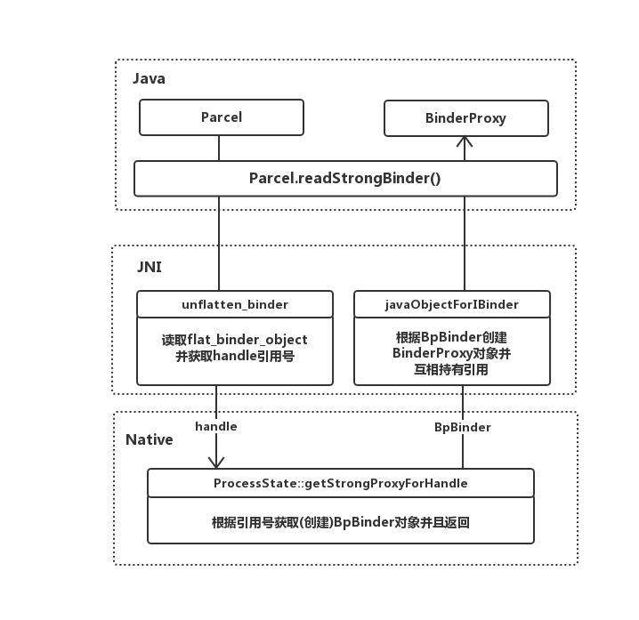

## 提纲
> * BinderProxy & BpBinder
>   1. 获取BinderProxy —— BinderProxy的创建
>   2. BinderProxy（BpBinder）发起请求逻辑
>   3. BinderProxy的唯一性保证
> 
> * Binder & BBinder
>   1. Binder的创建
>   2. Binder（BBinder）处理请求逻辑

# 从Binder的Java层JNI对象映射分析Binder的跨进程请求逻辑
## BinderProxy & BpBinder

### BinderProxy的创建
在Java层获取到的代理对象一般都是BinderProxy对象，如从Parcel中读取到的其它进程的Binder对象都是BinderProxy的实例；
```
/**
 * Java proxy for a native IBinder object.
 * Allocated and constructed by the native javaObjectforIBinder function. Never allocated
 * directly from Java code.
 */
```
BinderProxy上有这么一段注释，意思是BinderProxy对象只能由Native层的javaObjectforIBinder方法来创建，不能通过Java层代码来直接创建；

这里用ServiceManager通过Parcel获取一个远程的Binder代理对象，这个Binder代理对象由Native层对象转换成Java层BinderProxy对象的过程；
```
public IBinder getService(String name) throws RemoteException {
    Parcel data = Parcel.obtain();
    Parcel reply = Parcel.obtain();
    data.writeInterfaceToken(IServiceManager.descriptor);
    data.writeString(name);
    mRemote.transact(GET_SERVICE_TRANSACTION, data, reply, 0);
    //读取一个Binder代理对象
    IBinder binder = reply.readStrongBinder();
    reply.recycle();
    data.recycle();
    return binder;
}
```
通过Parcel.readStrongBinder方法获取一个IBinder代理对象；接着Parcel对象会调用native层对应的方法
```
static jobject android_os_Parcel_readStrongBinder(JNIEnv* env, jclass clazz, jlong nativePtr)
{
    Parcel* parcel = reinterpret_cast<Parcel*>(nativePtr);
    if (parcel != NULL) {
        return javaObjectForIBinder(env, parcel->readStrongBinder());
    }
    return NULL;
}
```

这里的javaObjectForIBinder就是之前注释提到的用来创建BinderProxy的方法，用到的参数则是通过`parcel->readStrongBinder()`获取到的;

```
status_t Parcel::readNullableStrongBinder(sp<IBinder>* val) const
{
    return unflatten_binder(ProcessState::self(), *this, val);
}
```
```
status_t unflatten_binder(const sp<ProcessState>& proc,
    const Parcel& in, sp<IBinder>* out)
{
    const flat_binder_object* flat = in.readObject(false);

    if (flat) {
        switch (flat->hdr.type) {
            case BINDER_TYPE_BINDER:
                *out = reinterpret_cast<IBinder*>(flat->cookie);
                return finish_unflatten_binder(NULL, *flat, in);
            case BINDER_TYPE_HANDLE:
                *out = proc->getStrongProxyForHandle(flat->handle);
                return finish_unflatten_binder(
                    static_cast<BpBinder*>(out->get()), *flat, in);
        }
    }
    return BAD_TYPE;
}
```
flat_binder_object结构体是Binder对象在Parcel中的表现形式，在读取到flat_binder_object结构体后获取flat_binder_object的类型，`BINDER_TYPE_BINDER`代表的是本地的Binder对象（BinderServer），`BINDER_TYPE_HANDLE`代表的是跨进程的Binder对象（BinderClient），接着看`ProcessState.getStrongProxyForHandle()`
```
sp<IBinder> ProcessState::getStrongProxyForHandle(int32_t handle)
{
    sp<IBinder> result;
    AutoMutex _l(mLock);

    //获取或者创建一个用于缓存BpBinder的节点
    handle_entry* e = lookupHandleLocked(handle);

    if (e != NULL) {
        IBinder* b = e->binder;
        
        if (b == NULL || !e->refs->attemptIncWeak(this)) {
            //如果节点中不存在BpBinder,说明节点是新创建的，则为Binder节点创建一个BpBinder
            if (handle == 0) {
                Parcel data;
                status_t status = IPCThreadState::self()->transact(
                        0, IBinder::PING_TRANSACTION, data, NULL, 0);
                if (status == DEAD_OBJECT)
                   return NULL;
            }

            b = new BpBinder(handle); 
            e->binder = b;
            if (b) e->refs = b->getWeakRefs();
            result = b;
        } else {
             //如果节点中存在BpBinder,则直接作为结果返回
            result.force_set(b);
            e->refs->decWeak(this);
        }
    }

    return result;
}
```
参数handle可以理解为远程Binder对象的引用，Binder底层（驱动层）可以通过这个引用找到这个Binder对象所在的进程；
ProcessState对象是进程单例，首先从ProcessState的缓存中查找是否存在一个Binder引用对应的Native层Binder对象也就是BpBinder，如果没有找到则创建了一个BpBinder，并且将handle引用号赋值给BpBinder；

BpBinder就是native层或者说JNI层的Binder代理对象的映射了，我们可以用BpBinder发起跨进程请求，只要把handle引用号带上，Binder驱动层就可以根据这个引用号找对应进程的Binder服务对象让它来处理请求；

这个BpBinder在进程单例ProcessState中有缓存，也就是说hanle引用号和BpBinder对象一一对应；

回到JNI方法`android_os_Parcel_readStrongBinder`，了解了`parcel->readStrongBinder()`返回的结果是BpBinder，接着看`javaObjectForIBinder`方法创建BinderProxy的逻辑

```
jobject javaObjectForIBinder(JNIEnv* env, const sp<IBinder>& val)
{
    ...
    //尝试从BpBinder中招是否存在BinderProxy对象
    jobject object = (jobject)val->findObject(&gBinderProxyOffsets);
    if (object != NULL) {
        jobject res = jniGetReferent(env, object);
        //确认弱引用是否被回收
        if (res != NULL) {
            return res;
        }
        ...
    }

    object = env->NewObject(gBinderProxyOffsets.mClass, gBinderProxyOffsets.mConstructor);
    if (object != NULL) {

        //将BpBinder的指针地址赋值给BinderProxy.mObject变量上
        env->SetLongField(object, gBinderProxyOffsets.mObject, (jlong)val.get());

        //创建一个全局引用，引用创建的BinderProxy的弱引用(gBinderProxyOffsets.mSelf对应BinderProxy.gBinderProxyOffsets.mSelf是一个对自身的WeakReference引用)
        jobject refObject = env->NewGlobalRef(
                env->GetObjectField(object, gBinderProxyOffsets.mSelf));

        //将全局引用缓存到BpBinder中
        val->attachObject(&gBinderProxyOffsets, refObject,
                jnienv_to_javavm(env), proxy_cleanup);

        ...
    }
    return object;
}
```
首先尝试从BpBinder中查找一下是否曾经创建过对应的BinderProxy对象，如果不存在则会创建；

gBinderProxyOffsets结构体是一个全局变量，记录着Java层的BinderProxy类的构造方法，以及jclass对象和几个关键变量的偏移量；通过JNI以及gBinderProxyOffsets中记录的信息创建了一个Java层的BinderProxy对象，接着又做了2件事情：

  1. 赋值BinderProxy.mObject = BpBinder的地址
  2. BpBinder创建并持有 WeakReference<BinderProxy> 引用


最后将BinderProxy对象返回给上层，也就是Parcel通过`Parcel.readStrongBinder`方法返回的IBinder对象；

整个调用流程可以用下图概括：




### BinderProxy（BpBinder）发起请求逻辑

通常通过AIDL来发起跨进程Binder请求的时候是如下步骤

1. 获取IBinder对象
2. 调用Ixxx.stub.asInterface(IBinder)
3. 通过返回的xxxProxy对象去调用约定好的接口方法

这里面最获取的IBinder对象就是BinderProxy类的实例，而xxxProxy调用约定好的前接口请求只不过是拼装好参数最后通过BinderProxy发起跨进程请求，xxxProxy只是BinderProxy的一个代理类，拿ServiceManager举个例子：

```
    public IServiceManager asInterface(IBinder obj)
    {
        ...
        return new ServiceManagerProxy(obj);
    }

    public ServiceManagerProxy(IBinder remote) {
        mRemote = remote;
    }

    public IBinder getService(String name) throws RemoteException {
        Parcel data = Parcel.obtain();
        Parcel reply = Parcel.obtain();
        data.writeInterfaceToken(IServiceManager.descriptor);
        data.writeString(name);
        mRemote.transact(GET_SERVICE_TRANSACTION, data, reply, 0);
        IBinder binder = reply.readStrongBinder();
        reply.recycle();
        data.recycle();
        return binder;
    }
```

可以看出最后调用的就是`IBinder.transact()`，也就是`BinderProxy.transact()`，而`BinderProxy.transact()`最终会调用到JNI层的`android_os_BinderProxy_transact()`方法；

```
static jboolean android_os_BinderProxy_transact(JNIEnv* env, jobject obj,
        jint code, jobject dataObj, jobject replyObj, jint flags) // throws RemoteException
{

    Parcel* data = parcelForJavaObject(env, dataObj);

    Parcel* reply = parcelForJavaObject(env, replyObj);

    IBinder* target = (IBinder*)
        env->GetLongField(obj, gBinderProxyOffsets.mObject);
    ...

    status_t err = target->transact(code, *data, reply, flags);
    ...
}
```
方法首先将Java层的Parce转换成了native层的Parcel对象，接着从当前BinderProxy中的mObject字段中获取BpBinder的地址，然后赋值给target变量；最后利用BpBinder调用`transact`方法来发起真正的跨进程请求；

从BinderProxy的创建和BinderProxy发起请求的逻辑都可以看出，BinderProxy只是BpBinder的一个Java层代理对象；

### Binder对象的一致性
在尝试获取Binder远程代理时会从Binder底层返回handle是都会在单例ProcessState的缓存中查看是否含有BpBinder，而BpBinder中又持有BinderProxy的弱引用，因此当Binder底层返回同一个远程Binder的引用号时，ProcessState会尝试返回BpBinder的缓存，BpBinder的缓存会返回BinderProxy的弱引用，最后从弱引用中获取BinderProxy实例

此时BinderProxy和BpBinder之间的映射关系可用下图概括：


只要Java层有强引用持有BinderProxy，BpBinder的弱引用持有的BinderProxy就不会回收；而BpBinder又和handle一一对应并且缓存在进程单例ProcessState中；

另外BinderServer端在收到Binder对象的引用也会在初次通讯时缓存在Binder底层，当收到请求时会原封还给上层来处理请求，因此BinderServer端获取到的IBinder对象也永远都是一个；

因此在BinderProxy不会回收的情况下可以得到这么一个结论

> BinderProxy(Client) -- BpBinder -- handle -- Binder(Server) 之间的关系是一一对应的；

从这里就可以解释为什么App进程中的Activity可以和ActivityManagerService中的进程通过ActivityRecord.Token进程一一映射；