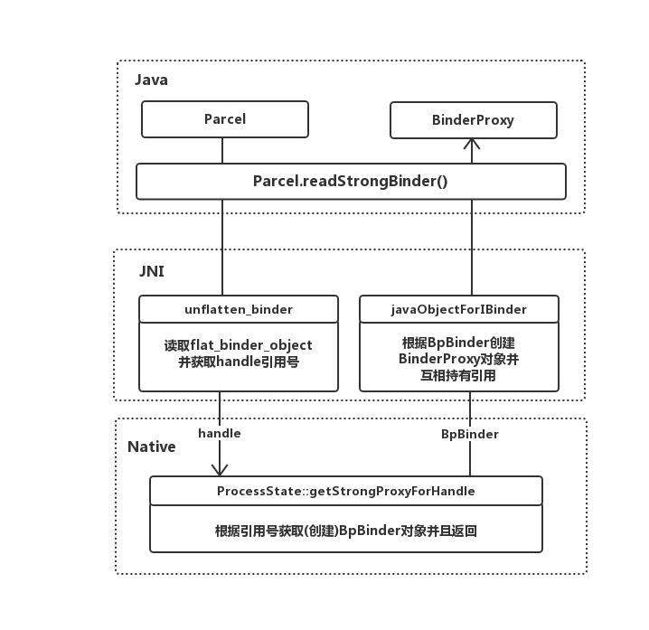
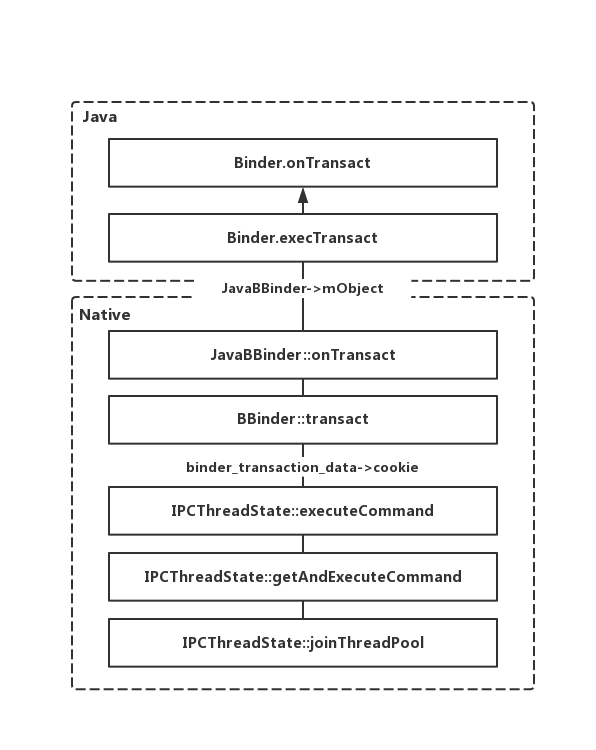
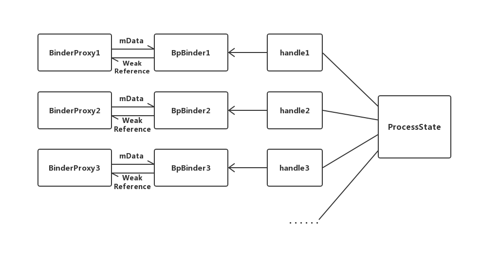

## 提纲
> * BinderProxy & BpBinder
>   1. 获取BinderProxy —— BinderProxy的创建
>   2. BinderProxy(BpBinder发起请求逻辑
>   3. BinderProxy的唯一性保证
> 
> * Binder & BBinder
>   1. Binder的创建
>   2. Binder(BBinder)处理请求逻辑

# 从Binder的Java层JNI对象映射分析Binder的跨进程请求逻辑
## BinderProxy & BpBinder

### BinderProxy(BpBinder)的创建
在Java层获取到的代理对象一般都是BinderProxy对象，如从Parcel中读取到的其它进程的Binder对象都是BinderProxy的实例；

BinderProxy上有这么一段注释
```
/**
 * Java proxy for a native IBinder object.
 * Allocated and constructed by the native javaObjectforIBinder function. Never allocated
 * directly from Java code.
 */
```
意思是BinderProxy对象只能由Native层的javaObjectforIBinder方法来创建，不能通过Java层代码来直接创建；

这里用ServiceManager为例，通过Parcel获取一个远程的Binder代理对象，这个Binder代理对象由Native层对象转换成Java层BinderProxy对象的过程；
```
public IBinder getService(String name) throws RemoteException {
    Parcel data = Parcel.obtain();
    Parcel reply = Parcel.obtain();
    data.writeInterfaceToken(IServiceManager.descriptor);
    data.writeString(name);
    mRemote.transact(GET_SERVICE_TRANSACTION, data, reply, 0);
    //读取一个Binder代理对象
    IBinder binder = reply.readStrongBinder();
    reply.recycle();
    data.recycle();
    return binder;
}
```
通过Parcel.readStrongBinder方法获取一个IBinder代理对象；接着Parcel对象会调用native层对应的方法
```
static jobject android_os_Parcel_readStrongBinder(JNIEnv* env, jclass clazz, jlong nativePtr)
{
    Parcel* parcel = reinterpret_cast<Parcel*>(nativePtr);
    if (parcel != NULL) {
        return javaObjectForIBinder(env, parcel->readStrongBinder());
    }
    return NULL;
}
```

这里的javaObjectForIBinder就是之前注释提到的用来创建BinderProxy的方法，用到的参数则是通过`parcel->readStrongBinder()`获取到的;

```
status_t Parcel::readNullableStrongBinder(sp<IBinder>* val) const
{
    return unflatten_binder(ProcessState::self(), *this, val);
}
```
```
status_t unflatten_binder(const sp<ProcessState>& proc,
    const Parcel& in, sp<IBinder>* out)
{
    const flat_binder_object* flat = in.readObject(false);

    if (flat) {
        switch (flat->hdr.type) {
            case BINDER_TYPE_BINDER:
                *out = reinterpret_cast<IBinder*>(flat->cookie);
                return finish_unflatten_binder(NULL, *flat, in);
            case BINDER_TYPE_HANDLE:
                *out = proc->getStrongProxyForHandle(flat->handle);
                return finish_unflatten_binder(
                    static_cast<BpBinder*>(out->get()), *flat, in);
        }
    }
    return BAD_TYPE;
}
```
flat_binder_object结构体是Binder对象在Parcel中的表现形式，在读取到flat_binder_object结构体后获取flat_binder_object的类型，`BINDER_TYPE_BINDER`代表的是本地的Binder对象（BinderServer），`BINDER_TYPE_HANDLE`代表的是跨进程的Binder对象（BinderClient），接着看`ProcessState.getStrongProxyForHandle()`
```
sp<IBinder> ProcessState::getStrongProxyForHandle(int32_t handle)
{
    sp<IBinder> result;
    AutoMutex _l(mLock);

    //获取或者创建一个用于缓存BpBinder的节点
    handle_entry* e = lookupHandleLocked(handle);

    if (e != NULL) {
        IBinder* b = e->binder;
        
        if (b == NULL || !e->refs->attemptIncWeak(this)) {
            //如果节点中不存在BpBinder,说明节点是新创建的，则为Binder节点创建一个BpBinder
            if (handle == 0) {
                Parcel data;
                status_t status = IPCThreadState::self()->transact(
                        0, IBinder::PING_TRANSACTION, data, NULL, 0);
                if (status == DEAD_OBJECT)
                   return NULL;
            }

            b = new BpBinder(handle); 
            e->binder = b;
            if (b) e->refs = b->getWeakRefs();
            result = b;
        } else {
             //如果节点中存在BpBinder,则直接作为结果返回
            result.force_set(b);
            e->refs->decWeak(this);
        }
    }

    return result;
}
```
参数handle可以理解为远程Binder对象的引用，Binder底层（驱动层）可以通过这个引用找到这个Binder对象所在的进程；
ProcessState对象是进程单例，首先从ProcessState的缓存中查找是否存在一个Binder引用对应的Native层Binder对象也就是BpBinder，如果没有找到则创建了一个BpBinder，并且将handle引用号赋值给BpBinder；

BpBinder就是native层或者说JNI层的Binder代理对象的映射了，我们可以用BpBinder发起跨进程请求，只要把handle引用号带上，Binder驱动层就可以根据这个引用号找对应进程的Binder服务对象让它来处理请求；

这个BpBinder在进程单例ProcessState中有缓存，也就是说hanle引用号和BpBinder对象一一对应；

回到JNI方法`android_os_Parcel_readStrongBinder`，了解了`parcel->readStrongBinder()`返回的结果是BpBinder，接着看`javaObjectForIBinder`方法创建BinderProxy的逻辑

```
jobject javaObjectForIBinder(JNIEnv* env, const sp<IBinder>& val)
{
    ...
    //尝试从BpBinder中招是否存在BinderProxy对象
    jobject object = (jobject)val->findObject(&gBinderProxyOffsets);
    if (object != NULL) {
        jobject res = jniGetReferent(env, object);
        //确认弱引用是否被回收
        if (res != NULL) {
            return res;
        }
        ...
    }

    object = env->NewObject(gBinderProxyOffsets.mClass, gBinderProxyOffsets.mConstructor);
    if (object != NULL) {

        //将BpBinder的指针地址赋值给BinderProxy.mObject变量上
        env->SetLongField(object, gBinderProxyOffsets.mObject, (jlong)val.get());

        //创建一个全局引用，引用创建的BinderProxy的弱引用(gBinderProxyOffsets.mSelf对应BinderProxy.gBinderProxyOffsets.mSelf是一个对自身的WeakReference引用)
        jobject refObject = env->NewGlobalRef(
                env->GetObjectField(object, gBinderProxyOffsets.mSelf));

        //将全局引用缓存到BpBinder中
        val->attachObject(&gBinderProxyOffsets, refObject,
                jnienv_to_javavm(env), proxy_cleanup);

        ...
    }
    return object;
}
```
首先尝试从BpBinder中查找一下是否曾经创建过对应的BinderProxy对象，如果不存在则会创建；

gBinderProxyOffsets结构体是一个全局变量，记录着Java层的BinderProxy类的构造方法，以及jclass对象和几个关键变量的偏移量；通过JNI以及gBinderProxyOffsets中记录的信息创建了一个Java层的BinderProxy对象，接着又做了2件事情：

  1. 赋值BinderProxy.mObject = BpBinder的地址
  2. BpBinder创建并持有 WeakReference\<BinderProxy\> 引用


最后将BinderProxy对象返回给上层，也就是Parcel通过`Parcel.readStrongBinder`方法返回的IBinder对象；

整个调用流程可以用下图概括：




### BinderProxy（BpBinder）发起请求逻辑

通常通过AIDL来发起跨进程Binder请求的时候是如下步骤

1. 获取IBinder对象
2. 调用Ixxx.stub.asInterface(IBinder)
3. 通过返回的xxxProxy对象去调用约定好的接口方法

这里获取的IBinder对象就是BinderProxy类的实例，而xxxProxy调用约定好的前接口请求只不过是拼装好参数最后通过BinderProxy发起跨进程请求，xxxProxy只是BinderProxy的一个代理类，拿ServiceManager举个例子：

```
    public IServiceManager asInterface(IBinder obj)
    {
        ...
        return new ServiceManagerProxy(obj);
    }

    public ServiceManagerProxy(IBinder remote) {
        mRemote = remote;
    }

    public IBinder getService(String name) throws RemoteException {
        Parcel data = Parcel.obtain();
        Parcel reply = Parcel.obtain();
        data.writeInterfaceToken(IServiceManager.descriptor);
        data.writeString(name);
        mRemote.transact(GET_SERVICE_TRANSACTION, data, reply, 0);
        IBinder binder = reply.readStrongBinder();
        reply.recycle();
        data.recycle();
        return binder;
    }
```

可以看出最后调用的就是`IBinder.transact()`，也就是`BinderProxy.transact()`，而`BinderProxy.transact()`最终会调用到JNI层的`android_os_BinderProxy_transact()`方法；

```
static jboolean android_os_BinderProxy_transact(JNIEnv* env, jobject obj,
        jint code, jobject dataObj, jobject replyObj, jint flags) // throws RemoteException
{

    Parcel* data = parcelForJavaObject(env, dataObj);

    Parcel* reply = parcelForJavaObject(env, replyObj);

    IBinder* target = (IBinder*)
        env->GetLongField(obj, gBinderProxyOffsets.mObject);
    ...

    status_t err = target->transact(code, *data, reply, flags);
    ...
}
```
方法首先将Java层的Parce转换成了native层的Parcel对象，接着从当前BinderProxy中的mObject字段中获取BpBinder的地址，然后赋值给target变量；最后利用BpBinder调用`transact`方法来发起真正的跨进程请求；

从BinderProxy的创建和BinderProxy发起请求的逻辑都可以看出，BinderProxy只是BpBinder的一个Java层代理对象；


## Binder & BBinder
### Binder(BBinder)对象的创建
不同于BinderProxy，Binder对象的创建一般都是在Java层完成的；而Binder对象为了能够为其它进程提供服务都会将自身写入Parcel传递给其它进程，例如最普遍的就是利用AIDL创建的xxx.Stub对象通过Service传递给其它组件，而这个Stub就是继承Binder类的一个对象；

Binder类的构造方法中有一个init方法
```
    public Binder() {
        init();
        ...
    }
```
这个init方法对应的则是native方法`android_os_Binder_init`
```
static void android_os_Binder_init(JNIEnv* env, jobject obj)
{
    JavaBBinderHolder* jbh = new JavaBBinderHolder();
    env->SetLongField(obj, gBinderOffsets.mObject, (jlong)jbh);
}
```
这里为Binder对象创建了JavaBBinderHolder对象；gBinderOffsets全局变量中记录着Java层Binder类的关键信息，通过记录的字段偏移量配合JNI赋值Binder中的`mObject`为JavaBBinderHolder对象的地址；而这个JavaBBinder则是JNI层Binder对象BBinder的封装类，一般可以通过`JavaBBinderHolder->get()`方法来获取到Java层Binder对应的JNI层`BBinder`对象


```
class JavaBBinderHolder : public RefBase
{
public:
    sp<JavaBBinder> get(JNIEnv* env, jobject obj)
    {
        sp<JavaBBinder> b = mBinder.promote();
        if (b == NULL) {
            b = new JavaBBinder(env, obj);
            mBinder = b;
        }
        return b;
    }
}    
```
代码中的JavaBBinder则是BBinder的一个子类；

```
class JavaBBinder : public BBinder
{
public:
    JavaBBinder(JNIEnv* env, jobject object)
        : mVM(jnienv_to_javavm(env)), mObject(env->NewGlobalRef(object))
    {
        android_atomic_inc(&gNumLocalRefs);
        incRefsCreated(env);
    }
}    
```
在JavaBBinder构造的时候会保存Java层Binder对象的引用到mObject变量中，和BinderProxy的形式类似，Java层和JNI层的对应对象会进行相互引用；


### Binder(BBinder)处理请求逻辑
在Binder对象在将自己通过Parcel跨进程传递给其它进程提供服务时就会在Binder驱动层记录下Binder对象的引用，当其它进程通过Binder对象对应的BinderProxy发起请求时，Binder驱动会找到对应的Binder对象引用进行处理；

通常App进程在启动时会在native层初始化去循环获取并且处理Binder请求（todo具体什么时候初始化需要再整理说明 `ZygoteConnection.processOneCommand()`）
```
void IPCThreadState::joinThreadPool(bool isMain) {
    mOut.writeInt32(isMain ? BC_ENTER_LOOPER : BC_REGISTER_LOOPER);

    status_t result;
    do {
        //开始轮询并且处理跨进程的请求
        result = getAndExecuteCommand();
    } while (result != -ECONNREFUSED && result != -EBADF);

    mOut.writeInt32(BC_EXIT_LOOPER);
    talkWithDriver(false);
}
```
最后会调用到`IPCThreadState::executeCommand`
```
status_t IPCThreadState::executeCommand(int32_t cmd)
{
    BBinder* obj;

    switch ((uint32_t)cmd) {
    
    case BR_TRANSACTION:
        {
            binder_transaction_data tr;
            // 读取请求相关的数据
            result = mIn.read(&tr, sizeof(tr));

            Parcel buffer;
            // 读取请求的参数相关的数据
            buffer.ipcSetDataReference(
                reinterpret_cast<const uint8_t*>(tr.data.ptr.buffer),
                tr.data_size,
                reinterpret_cast<const binder_size_t*>(tr.data.ptr.offsets),
                tr.offsets_size/sizeof(binder_size_t), freeBuffer, this);

            Parcel reply;
            status_t error;
        
            // tr.cookie为BBinder的地址，也就是之前的JavaBBinder对象的地址，buffer是参数Parcel
            error = reinterpret_cast<BBinder*>(tr.cookie)->transact(tr.code, buffer,
                            &reply, tr.flags);
        }
        break;
    }
    return result;
}
```
方法从binder驱动返回给Native层的binder_transaction_data中获取对应的参数以及需要调用的BBinder对象`tr.cookie`，最后调用`tr.cookie->transact`对象；最后实际上调用的是`BBinder->transact`方法；
```
status_t BBinder::transact(
    uint32_t code, const Parcel& data, Parcel* reply, uint32_t flags)
{
    switch (code) {
        case PING_TRANSACTION:
            reply->writeInt32(pingBinder());
            break;
        default:
            // 这里会调用到JavaBBinder的onTransact方法；
            err = onTransact(code, data, reply, flags);
            break;
    }
    return err;
}
```
接着会调用到JavaBBinder实现的onTransact方法；
```
virtual status_t onTransact(uint32_t code, const Parcel& data, Parcel* reply, uint32_t flags = 0)
{
    JNIEnv* env = javavm_to_jnienv(mVM);
    IPCThreadState* thread_state = IPCThreadState::self();

    //调用到Java层Binder的execTransact方法
    jboolean res = env->CallBooleanMethod(mObject, gBinderOffsets.mExecTransact,
        code, reinterpret_cast<jlong>(&data), reinterpret_cast<jlong>(reply), flags);

    return res != JNI_FALSE ? NO_ERROR : UNKNOWN_TRANSACTION;
}
```
```
    private boolean execTransact(int code, long dataObj, long replyObj,
            int flags) {
        Parcel data = Parcel.obtain(dataObj);
        Parcel reply = Parcel.obtain(replyObj);

        boolean res = onTransact(code, data, reply, flags);

        reply.recycle();
        data.recycle();

        return res;
    }
}
```
最后回调到Java层Binder对象的onTransact方法来进行对应的业务处理；而在AIDL这套框架中，onTransact通常会在xxx.Stub中实现具体的业务；



#### Binder对象的一致性
在尝试获取Binder远程代理时会从Binder底层返回handle时都会在单例ProcessState的缓存中查看是否含有BpBinder，而BpBinder中又持有BinderProxy的弱引用，因此当Binder底层返回同一个远程Binder的引用号时，ProcessState会尝试返回BpBinder的缓存，BpBinder的缓存会返回BinderProxy的弱引用，最后从弱引用中获取BinderProxy实例

此时BinderProxy和BpBinder之间的映射关系可用下图概括：



只要Java层有强引用持有BinderProxy，BpBinder的弱引用持有的BinderProxy就不会回收；而BpBinder又和handle一一对应并且缓存在进程单例ProcessState中；

另外BinderServer端在收到Binder对象的引用会在向其它进程发送Binder对象时被记录在驱动层，当收到请求时会从驱动层获取之前记录的Java层Binder对象地址还给上层来处理请求，因此BinderServer端获取到的IBinder对象也永远都是一个；

在BinderProxy不会回收的情况下可以得到这么一个结论

> BinderProxy(Client) -- BpBinder -- handle -- Binder(Server) 之间的关系是一一对应的；

从这里就可以解释为什么App进程中的Activity可以和ActivityManagerService中的进程通过ActivityRecord.Token进程一一映射；