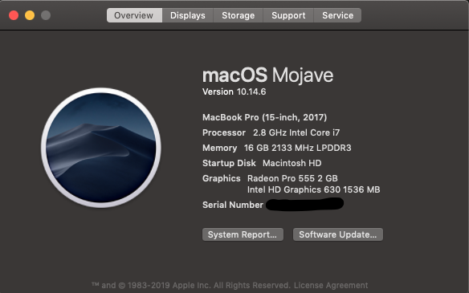
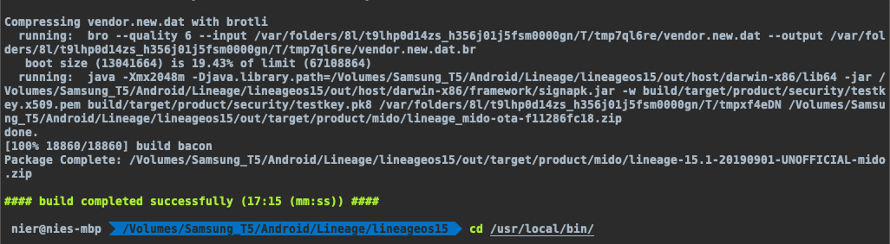

## 编译LineageOS 15.1
以下是Android LineageOS 15.1源码编译，用的是MAC OSX 10.14.6 系统，本人在ubuntu 18.04中编译没有任何问题，以下主要是MAC编译过程中遇到的全部问题记录。



#### 1. 配置ADB
配置环境变量, 添加到`.bash_rc`、`.bash_profile`中
```
# add Android SDK platform tools to path
if [ -d "$HOME/platform-tools" ] ; then
    PATH="$HOME/platform-tools:$PATH"
fi
```
#### 2. 安装依赖
##### ubuntu 依赖
```
bc bison build-essential ccache curl flex g++-multilib gcc-multilib git gnupg gperf imagemagick lib32ncurses5-dev lib32readline-dev lib32z1-dev liblz4-tool libncurses5-dev libsdl1.2-dev libssl-dev libwxgtk3.0-dev libxml2 libxml2-utils lzop pngcrush rsync schedtool squashfs-tools xsltproc zip zlib1g-dev

For Ubuntu versions older than 16.04 (xenial), substitute:
libwxgtk3.0-dev → libwxgtk2.8-dev

JDK
LineageOS 16.0: OpenJDK 1.9 (included by default)
LineageOS 14.1-15.1: OpenJDK 1.8 (install openjdk-8-jdk)
LineageOS 11.0-13.0: OpenJDK 1.7 (install openjdk-7-jdk)*
```

##### mac 依赖
######  安装Xcode
之后执行`$ xcode-select --install`

###### 安装MacPorts
下载安装MacPorts https://www.macports.org/install.php ，配置`export PATH=/opt/local/bin:$PATH`到`～/.bash_profile`中
```
POSIXLY_CORRECT=1 sudo port install gmake libsdl git gnupg
```
在 Mac OS 中，可同时打开的文件描述符的默认数量上限太低，在高度并行的编译流程中，可能会超出此上限。要提高此上限，请将下列行添加到 `~/.bash_profile` 中：` ulimit -S -n 1024`

备注：gnupg要通过brew来安装，MacPorts安装不了,好像是被废弃了。

#### 3. 安装repo

```
mkdir -p ~/bin
curl https://storage.googleapis.com/git-repo-downloads/repo > ~/bin/repo
chmod a+x ~/bin/repo
```
配置环境变量, 添加到`.bash_rc`、`.bash_profile`中
```
# set PATH so it includes user's private bin if it exists
if [ -d "$HOME/bin" ] ; then
    PATH="$HOME/bin:$PATH"
fi
```

#### 4.初始化源码目录
初始化环境
cm-14.1
lineage-15.1
```
mkdir -p ~/android/lineage
cd ~/android/lineage
repo init -u https://github.com/LineageOS/android.git -b lineage-15.1
```

#### 5. 下载源码
```
repo sync -j8
```

#### 6. 编译前准备
```
# mido为红米Note4到型号

source build/envsetup.sh
breakfast mido 
```
如果中间出现了Vendor相关到错误连接装有LineageOS的真机
```
cd ~/android/lineage/device/xiaomi/mido 
./extract-files.sh
```
##### 问题1
无法导出相关文件，真机adb赋予root权限后执行

##### 问题2
MAC环境sed命令报错，编辑`extract-files.sh`脚本
```
原：
sed -i "s|/system/etc/camera/|/vendor/etc/camera/|g" "$CAMERA2_SENSOR_MODULES"

改：
LC_ALL=C sed -i '' -e "s|/system/etc/camera/|/vendor/etc/camera/|g" "$CAMERA2_SENSOR_MODULES"
```

##### 问题3
```
destroy_build_var_cache:unset:5: var_cache_ 2ND_TARGET_GCC_VERSION ANDROID_BUILD_PATHS BUILD_OS LLVM_PREBUILTS_VERSION OUT_DIR TARGET_2ND_ARCH TARGET_ARCH TARGET_BUILD_VARIANT TARGET_DEVICE TARGET_GCC_VERSION TARGET_PLATFORM_VERSION TARGET_PRODUCT print report_config : invalid parameter name
```

执行下述命令
```
setopt shwordsplit
export LC_ALL=C
```

#### 7. 编译
依次执行
```
export USE_CCACHE=1
ccache -M 50G
export CCACHE_COMPRESS=1
export ANDROID_JACK_VM_ARGS="-Dfile.encoding=UTF-8 -XX:+TieredCompilation -Xmx4G"
croot
brunch mido
```


##### 问题1
```
FAILED: /Volumes/Samsung_T5/Android/Lineage/lineageos15/out/soong/.intermediates/frameworks/compile/mclinker/lib/Script/libmcldScript/android_arm64_armv8-a_static_core/gen/yacc/frameworks/compile/mclinker/lib/Script/ScriptParser.cpp /Volumes/Samsung_T5/Android/Lineage/lineageos15/out/soong/.intermediates/frameworks/compile/mclinker/lib/Script/libmcldScript/android_arm64_armv8-a_static_core/gen/yacc/frameworks/compile/mclinker/lib/Script/ScriptParser.h
```

重装xcode-select
```
sudo rm -rf /Library/Developer/CommandLineTools
xcode-select --install
```


##### 问题2
```
ld: symbol(s) not found for architecture i386
clang.real: error: linker command failed with exit code 1 (use -v to see invocation)
[  0% 307/88870] //external/conscrypt:libconscrypt_...mmon/src/jni/main/cpp/NativeCrypto.cpp [darwin x86]
ninja: build stopped: subcommand failed.
15:06:22 ninja failed with: exit status 1
```
解决1:

下载 `MacOSX10.11.sdk.tar.xz` 文件
然后将解压得到的`MacOSX10.11.sdk`文件夹复制到`/Applications/Xcode.app/Contents/Developer/Platforms/MacOSX.platform/Developer/SDKs`文件夹下

解决2:

Command Line Tools macOS 10.13 for Xcode 9.3
https://developer.apple.com/download/more/

我也不知道怎么搞好的，总之以上两步我全部都做了


##### 问题3
```
FAILED: /Volumes/Samsung_T5/Android/Lineage/lineageos15/out/soong/.intermediates/system/tools/hidl/libhidl-gen-ast/darwin_x86_64_shared/gen/yacc/system/tools/hidl/hidl-gen_y.cpp /Volumes/Samsung_T5/Android/Lineage/lineageos15/out/soong/.intermediates/system/tools/hidl/libhidl-gen-ast/darwin_x86_64_shared/gen/yacc/system/tools/hidl/hidl-gen_y.h
BISON_PKGDATADIR=external/bison/data prebuilts/misc/darwin-x86/bison/bison -d  --defines=/Volumes/Samsung_T5/Android/Lineage/lineageos15/out/soong/.intermediates/system/tools/hidl/libhidl-gen-ast/darwin_x86_64_shared/gen/yacc/system/tools/hidl/hidl-gen_y.h -o /Volumes/Samsung_T5/Android/Lineage/lineageos15/out/soong/.intermediates/system/tools/hidl/libhidl-gen-ast/darwin_x86_64_shared/gen/yacc/system/tools/hidl/hidl-gen_y.cpp system/tools/hidl/hidl-gen_y.yy
```
bison库有问题，需要重新编译
```
Patch [bison fix](https://android-review.googlesource.com/c/platform/external/bison/+/517740) for High Sierra and build bison:

    1. cd /Volumes/AOSP/external/bison
    2. git cherry-pick c0c852bd6fe462b148475476d9124fd740eba160
    3. mm

Replace prebuilt bison binary with patched binary

    1. cp /Volumes/AOSP/out/host/darwin-x86/bin/bison /Volumes/AOSP/prebuilts/misc/darwin-x86/bison/

Build

    1. make  -j4

```


##### 问题4

```
FAILED: /Volumes/Samsung_T5/Android/Lineage/lineageos15/out/target/product/mido/obj/KERNEL_OBJ/.headers_install_deps
/bin/bash -c "(rm -f /Volumes/Samsung_T5/Android/Lineage/lineageos15/out/target/product/mido/obj/KERNEL_OBJ/.headers_install_deps ) && (make -j8  CFLAGS_MODULE=\"-fno-pic\" C_INCLUDE_PATH=/Volumes/Samsung_T5/Android/Lineage/lineageos15/external/elfutils/libelf:/usr/local/opt/openssl/include LIBRARY_PATH=/usr/local/opt/openssl/lib -C kernel/xiaomi/msm8953 O=/Volumes/Samsung_T5/Android/Lineage/lineageos15/out/target/product/mido/obj/KERNEL_OBJ ARCH=arm64 CROSS_COMPILE=\"/usr/local/bin/ccache aarch64-linux-androidkernel-\"   headers_install ) && (echo \"/Volumes/Samsung_T5/Android/Lineage/lineageos15/out/target/product/mido/obj/KERNEL_OBJ/.headers_install_deps: \\\\\" > /Volumes/Samsung_T5/Android/Lineage/lineageos15/out/target/product/mido/obj/KERNEL_OBJ/.headers_install_deps ) && (( cd kernel/xiaomi/msm8953; 		if grep -q '^version_h' 'Makefile'; then 			depdirs=\"arch/arm64/include/uapi include/uapi\"; 		else 			depdirs=\"arch/arm64/include/asm include\"; 		fi; 		deps=\"Makefile \$(find \$depdirs -type f -name '*.h')\"; 		for f in \$deps; do 			echo \"  kernel/xiaomi/msm8953/\$f \\\\\" >> /Volumes/Samsung_T5/Android/Lineage/lineageos15/out/target/product/mido/obj/KERNEL_OBJ/.headers_install_deps; 		done ; 		echo \"\" >> /Volumes/Samsung_T5/Android/Lineage/lineageos15/out/target/product/mido/obj/KERNEL_OBJ/.headers_install_deps ; 		for f in \$deps; do 			echo \"kernel/xiaomi/msm8953/\$f:\" >> /Volumes/Samsung_T5/Android/Lineage/lineageos15/out/target/product/mido/obj/KERNEL_OBJ/.headers_install_deps; 			echo \"\" >> /Volumes/Samsung_T5/Android/Lineage/lineageos15/out/target/product/mido/obj/KERNEL_OBJ/.headers_install_deps; 		done 		) )"
/Volumes/Samsung_T5/Android/Lineage/lineageos15/kernel/xiaomi/msm8953/arch/arm64/Makefile:130: warning: overriding commands for target `vdso_prepare'
/Volumes/Samsung_T5/Android/Lineage/lineageos15/kernel/xiaomi/msm8953/arch/arm64/Makefile:120: warning: ignoring old commands for target `vdso_prepare'
  CHK     include/generated/uapi/linux/version.h
  INSTALL usr/include/asm-generic/ (35 files)
  INSTALL usr/include/drm/ (20 files)
  INSTALL usr/include/misc/ (1 file)
  INSTALL usr/include/mtd/ (5 files)
  INSTALL usr/include/rdma/ (6 files)
  INSTALL usr/include/media/ais/ (6 files)
  INSTALL usr/include/scsi/fc/ (4 files)
sed: illegal option -- r
usage: sed script [-Ealn] [-i extension] [file ...]
       sed [-Ealn] [-i extension] [-e script] ... [-f script_file] ... [file ...]
sed: illegal option -- r
usage: sed script [-Ealn] [-i extension] [file ...]
       sed [-Ealn] [-i extension] [-e script] ... [-f script_file] ... [file ...]
  INSTALL usr/include/linux/../../../usr/include/linux/staging/android/uapi/ (2 files)
sed: illegal option -- r
usage: sed script [-Ealn] [-i extension] [file ...]
       sed [-Ealn] [-i extension] [-e script] ... [-f script_file] ... [file ...]
sed: illegal option -- r
usage: sed script [-Ealn] [-i extension] [file ...]
       sed [-Ealn] [-i extension] [-e script] ... [-f script_file] ... [file ...]
sed: illegal option -- r
usage: sed script [-Ealn] [-i extension] [file ...]
       sed [-Ealn] [-i extension] [-e script] ... [-f script_file] ... [file ...]
make[3]: *** [usr/include/drm/.install] Error 1make[3]:
*** [usr/include/asm-generic/.install] Error 1
make[2]: *** [drm] Error 2
make[2]: *** Waiting for unfinished jobs....
make[2]: *** [asm-generic] Error 2
sed: illegal option -- r
usage: sed script [-Ealn] [-i extension] [file ...]
       sed [-Ealn] [-i extension] [-e script] ... [-f script_file] ... [file ...]
make[3]: *** [usr/include/misc/.install] Error 1
make[2]: *** [misc] Error 2
  INSTALL usr/include/media/ (21 files)
make[3]: *** [usr/include/mtd/.install] Error 1
make[3]: *** [usr/include/rdma/.install] Error 1
make[2]: *** [mtd] Error 2
make[2]: *** [rdma] Error 2
sed: illegal option -- r
```
```
ln -s /usr/local/bin/gfind /usr/local/bin/find && ln -s /usr/local/bin/gsed /usr/local/bin/sed && ln -s /usr/local/bin/gstat /usr/local/bin/stat
```

MAC sed命令有问题，需要安装gsed,让sed指向gsed
```
brew install gnu-sed

ln -s /usr/local/bin/gsed /usr/local/bin/sed
```


##### 问题5
```
../../../../../../kernel/xiaomi/msm8953/arch/arm64/include/asm/vdso.h:34:11: error: 'vdso_offset_sigtramp' undeclared (first use in this function)
  (void *)(vdso_offset_##name - VDSO_LBASE + (unsigned long)(base)); \
```

```
更改lineageos15/kernel/xiaomi/msm8953/arch/arm64/kernel/vdso/gen_vdso_offsets.sh脚本 
中 
's/^\([0-9a-fA-F]*\) . VDSO_\([a-zA-Z0-9_]*\)$/\#define vdso_offset_\2\t0x\1/p'
改为
's/^\([0-9a-fA-F]*\) . VDSO_\([a-zA-Z0-9_]*\)$/\#define vdso_offset_\2  0x\1/p'
```
**注意这里只是把\t换成“空格”,其他不做改动**，另外改完以后需要把输出目录的.h文件删除
```
rm -f /Volumes/Samsung_T5/Android/Lineage/lineageos15/out/target/product/mido/obj/KERNEL_OBJ/include/generated/vdso-offsets.h
```

##### 编译完成


#### EX. 生成AndroidStudio源码项目文件
```
source build/envsetup.sh
mmm development/tools/idegen
```
##### 问题1
MAC系统，报错`Couldn't locate the directory development/tools/idegen`

MAC环境切换成bash命令行
```
bash
```


##### 问题2
MAC系统，报错`internal error: Could not find a supported mac sdk: ["10.10" "10.11" "10.12"]`

编辑build/soong/cc/config/x86_darwin_host.go 
```
darwinSupportedSdkVersions = []string{
        "10.10",
        "10.11",
        "10.12",
        "10.13",
        "10.14",
```


##### 问题3
```
ninja: no work to do.
[21/21] /Volumes/Samsung_T5/Android/Lineage/lineageos15/ou...msung_T5/Android/Lineage/lineageos15/out/soong/build.ninja
/Volumes/Samsung_T5/Android/Lineage/lineageos15/out/build-lineage_mido-_development_tools_idegen_Android.mk.ninja is missing, regenerating...
[ 99% 1595/1596] glob external/llvm/lib/Analysis/*.cpp
ninja: error: '/Volumes/Samsung_T5/Android/Lineage/lineageos15/out/host/common/obj/JAVA_LIBRARIES/guavalib_intermediates/classes.jar', needed by '/Volumes/Samsung_T5/Android/Lineage/lineageos15/out/host/common/obj/JAVA_LIBRARIES/idegen_intermediates/classes-full-debug.jar', missing and no known rule to make it
23:58:03 ninja failed with: exit status 1
```

回到根目录
```
make idegen
sh ./development/tools/idegen/idegen.sh
```

##### 问题4
```
ninja: no work to do.
[1/1] /Volumes/Samsung_T5/Android/Lineage/lineageos15/out/...msung_T5/Android/Lineage/lineageos15/out/soong/build.ninja
/Volumes/Samsung_T5/Android/Lineage/lineageos15/out/build-lineage_mido.ninja is missing, regenerating...
[2/1070] including ./art/Android.mk ...
art/build/Android.common.mk:50: warning: unsupported HOST_ARCH=x86_64
[132/1070] including ./device/xiaomi/mido/Android.mk ...
build/core/binary.mk:47: warning: hal3-test-app uses kernel headers, but does not depend on them!
[1058/1070] including ./vendor/lineage/bootanimation/Android.mk ...
**********************************************
The boot animation could not be generated as
ImageMagick is not installed in your system.

Please install ImageMagick from this website:
https://imagemagick.org/script/binary-releases.php
**********************************************
./vendor/lineage/bootanimation/Android.mk:50: error: stop.
00:03:45 ckati failed with: exit status 1

#### failed to build some targets (54 seconds) ####
```
安装ImageMagick
```
brew install ImageMagick
```

##### 问题5
Android studio 不停 scanning files to index

Open module setting --> Modules --> 找到gen文件夹  --> 右键选择Resources

### 总结
Linux没有任何问题，以上全是MAC编译的问题。如果想省心还是用ubuntu来编译源码吧。