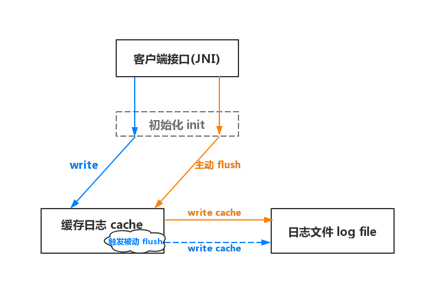
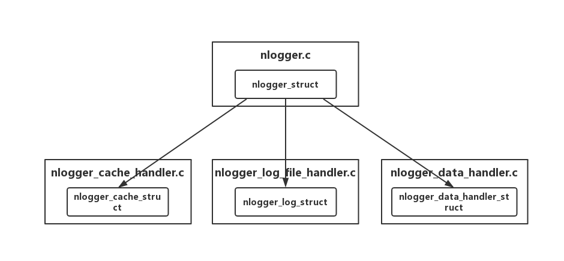

# NLogger
## 说明
Nlogger库整体借鉴美团Logan库做细节修改实现的，如本篇说明有疑问可以参考Logan库

## 整体架构模块
NLogger日志库主要分为三个主要模块
* 客户端接口：负责接收客户端请求并调用NLogger来发起日志记录请求，以及flush缓存日志到目标日志文件中
* 缓存日志：负责第一时间处理并保存客户端发送的日志。目前可能有两种实现，MemoryCache（内存缓存）和MmapCache（内存映射缓存）
* 日志文件：负责保存最终的日志文件，用于本地解析或上报服务端

## NLogger主要API
* init：初始化操作，主要是做日志写入前的一些预配置操作，如创检查建日志保存目录，初始化mmap；
* write：写入客户端发送来的一段日志到缓存中，如满足指定条件会主动将缓存日志flush到目标日志文件中；
* flush：负责将缓存中到日志读取并且写入到目标日志文件中；当写入日志符合一定条件或者客户端主动发起请求都将会触发flush操作

#### 架构模块及API交互流程图



## Nlogger代码结构
Nlogger中负责主要操作流程管理的文件是`nlogger.c`，对应的用于保存状态的结构体`nlogger_struct`。`nlogger_struct`结构体中又包含着4个变量

* state：负责记录整个库的状态；
* nlogger_cache_struct：负责处理缓存日志写入读取等操作
* nlogger_log_struct：负责处理目标日志文件的写入等操作
* nlogger_data_handler_struct：负责数据压缩加密等操作

而上述的三个结构体又配合着各自的三个c文件提供的方法完成Nlogger库所需要的一系列操作，具体结构如下：



整个日志库逻辑如上图，`nlogger.c`负责接收所需要执行的操作（如：init、wirte、flush），然后将需要执行的操作细分成小操作分别调用上述三个c文件`nlogger_cache_handler.c` `nlogger_log_file_handler.c` `nlogger_data_handler.c`的子操作配合完成任务。


整个过程中三个c文件操作状态全部都存储在各自对应的结构体`nlogger_cache_struct` `nlogger_log_struct` `nlogger_data_handler_struct`中。而结构体`nlogger_struct`统一持有管理这三个结构体。

#### 设计目的
1. 操作解耦，每个模块只负责自己的操作与状态的管理
2. 避免`nlogger.c`持有过多的状态（字段），减少复杂度
3. 方便状态的跟踪记录，随时可以从`nlogger_struct`中获取到当前各个模块的状态


## Nlogger实现细节

### init_初始化
```
# nlogger_native_interface.c

JNIEXPORT jint JNICALL
Java_com_nier_nlogger_NLogger_nativeInit(JNIEnv *env,
                                              jobject instance,
                                              jstring cache_path_,
                                              jstring dir_path_,
                                              jint max_file,
                                              jstring encrypt_key16_,
                                              jstring encrypt_iv16_) {
    const char *dir_path      = (*env)->GetStringUTFChars(env, dir_path_, 0);
    const char *cache_path    = (*env)->GetStringUTFChars(env, cache_path_, 0);
    const char *encrypt_key16 = (*env)->GetStringUTFChars(env, encrypt_key16_, 0);
    const char *encrypt_iv16  = (*env)->GetStringUTFChars(env, encrypt_iv16_, 0);

    jint code = (jint) init_nlogger(dir_path, cache_path, encrypt_key16, encrypt_iv16);

    (*env)->ReleaseStringUTFChars(env, dir_path_, dir_path);
    (*env)->ReleaseStringUTFChars(env, cache_path_, cache_path);
    (*env)->ReleaseStringUTFChars(env, encrypt_key16_, encrypt_key16);
    (*env)->ReleaseStringUTFChars(env, encrypt_iv16_, encrypt_iv16);
    return code;
}
```
由接口函数（JNI）调用`Java_com_nier_nlogger_NLogger_nativeInit`函数进行初始化，主要参数：
* cache_path：缓存文件存储的目录
* dir_path：日志文件存储的目录
* max_file：日志最大存储量（暂时无用）
* encrypt_key16：加密用的key（NLogger采用AES加密）
* encrypt_iv16：加密偏移量

最后将这些参数传递给调用`nlogger.c`的init_nlogger函数，让它来完成初始化工作
```
# nlogger.c

int init_nlogger(const char *log_file_dir, const char *cache_file_dir, const char *encrypt_key,
                 const char *encrypt_iv) {
 
    ...

    //创建日志文件的存放目录
    set_log_file_save_dir(&g_nlogger->log, log_file_dir);

    //配置加密相关的参数
    init_encrypt(&g_nlogger->data_handler, encrypt_key, encrypt_iv);

    //初始换并且创建缓存（优先创建mmap）
    int init_cache_result = init_cache(&g_nlogger->cache, cache_file_dir);

    ...

    //尝试进行一次flush，将上次应用关闭前未flush的cache写入到日志文件中
    flush_nlogger();

    return ERROR_CODE_OK;
}
```
初始化工作核心工作有4点：
##### 1. 创建保存日志目录
调用`nlogger_log_file_handler.c`的set_log_file_save_dir函数创建日志文件点存放目录，并且保存到传入的`nlogger_log_struct`中；
##### 2. 保存加密key和偏移量
调用`nlogger_data_handler`的init_encrypt函数保存加密用的key和偏移量到传入的`nlogger_data_handler_struct`中;
##### 3. 创建缓存目录 & 初始化缓存
调用`nlogger_cache_handler`的init_cache函数创建缓存日志的目录，然后初始化缓存（mmap缓存或者内存缓存，mmap优先）
##### 4. flush
尝试一次flush，操作检查有没有之前未来得及flush的缓存日志，将缓存写入到对应的日志文件中；（只有mmap缓存才需要）

（整个Nlogger处理任务的方法的流程都如上述一样:调用对应模块的函数，然后将模块对应的结构体地址传入。后面这方面细节就不再赘述了）

### write_写入日志到cache
```
# nlogger_native_interface.c

JNIEXPORT jint JNICALL
Java_com_nier_nlogger_NLogger_nativeWrite(JNIEnv *env, jobject instance,
                                               jstring file_name_, jint flag,
                                               jstring log_, jlong local_time,
                                               jstring thread_name_, jlong thread_id,
                                               jint is_main) {
    const char *file_name   = (*env)->GetStringUTFChars(env, file_name_, 0);
    const char *log         = (*env)->GetStringUTFChars(env, log_, 0);
    const char *thread_name = (*env)->GetStringUTFChars(env, thread_name_, 0);

    jint code = (jint) write_nlogger(file_name, flag, log, local_time, thread_name, thread_id, is_main);

    (*env)->ReleaseStringUTFChars(env, log_, log);
    (*env)->ReleaseStringUTFChars(env, thread_name_, thread_name);
    (*env)->ReleaseStringUTFChars(env, file_name_, file_name);
    return code;

}
```
由接口函数（JNI）调用`Java_com_nier_nlogger_NLogger_nativeWrite`函数进行初始化，主要参数：
* file_name_：需要将日志写入的文件名；
* flag：日志协议字段，最后被插入到到日志中；
* log：日志内容；
* local_time：日志记录的时间；
* thread_name：记录日志的线程名称；
* thread_id：记录日志的线程id；
* is_main_：记录日志的线程是否是主线程；
最后调用`nlogger.c`的write_nlogger函数来处理日志并且将日志写入

```
# nlogger.c

int write_nlogger(const char *log_file_name, int flag, char *log_content, long long local_time, char *thread_name,
                  long long thread_id, int is_main) {
                  
    ...

    //step1 检查缓存状态
    int check_cache_result = check_cache_healthy(&g_nlogger->cache);

    ...

    //step2 检查日志文件
    int check_log_result = check_log_file_healthy(&g_nlogger->log, log_file_name);

    ...

    //step3 组装日志
    char *result_json_data;
    int  build_result;
    build_result = build_log_json_data(&g_nlogger->cache, flag, log_content, local_time,
                                       thread_name, thread_id, is_main, &result_json_data);
     ...
  
    //step4 分段压缩加密写入
    int result = _write_data(&g_nlogger->cache, &g_nlogger->data_handler, result_json_data, log_json_data_length);

    return result;
}

```
省略了一些与主流程无关的代码，写入流程主要分为4个步骤：
##### 1. 检查缓存状态
判断当前缓存日志是否正常，如果不正常则会尝试采用其他降级处理方案，如mmap日志缓存异常，切换成memory内存日志缓存。

##### 2. 检查日志文件
检查日志文件是否正常，如果不正常尝试恢复，如当前需要写入的日志文件和Nlogger中正打开着的日志文件不是同一个，则需要关闭当前日志文件并且重新初始化再进行写入。当然具体操作并没有那么简单，有兴趣可以跟一下代码。

##### 3. 组装日志
按照NLogger的协议将日志组装成一个json格式的字符串并且写入到指定的内存地址。

##### 4. 分段压缩加密写入
将日志分解成固定大小长度的日志段，进行压缩加密最后写入到cache中。此过程中满足特定条件会触发flush操作，如cache超过一定大小时会进行flush或者当前为MemoryCache内存缓存模式为了避免日志丢失也会时时flush；
这里分段压缩再加密是为了防止内存抖动，避免压缩过程中zlib库一次申请过多内存；
加密压缩这两部操作的顺序是先压缩后加密，目的是为了提高加密效率；
关于这块的流程内容比较多，有兴趣可以跟一下代码。（还是比较希望能帮忙审阅一下代码有没有什么bug ^_^）

### flush_写入cache到log文件中
```
# nlogger_native_interface.c

JNIEXPORT jint JNICALL
Java_com_nier_nlogger_NLogger_nativeFlush(JNIEnv *env, jobject instance) {
    return flush_nlogger();
}
```
由接口函数（JNI）调用`Java_com_nier_nlogger_NLogger_nativeFlush`函数来完成，此函数不需要参数，直接调用`nlogger.c`的flush_nlogger函数；

```
# nlogger.c
int flush_nlogger() {
    if (g_nlogger == NULL || g_nlogger->state == NLOGGER_STATE_ERROR) {
        return ERROR_CODE_NEED_INIT_NLOGGER_BEFORE_ACTION;
    }

    print_current_nlogger(g_nlogger);

    //step1 检查数据处理状态，是否在压缩状态，如果在压缩处理数据阶段则先finish
    if (is_data_handler_processing(&g_nlogger->data_handler)) {
        int finish_result = _end_current_section(&g_nlogger->data_handler, &g_nlogger->cache);
        if (finish_result != ERROR_CODE_OK) {
            return finish_result;
        }
//        _update_length(&g_nlogger->cache);
    }

    //step2 检查日志文件, 在没有文件名的情况下去flush的时候需要从mmap中获取文件名然后再打开
    //（这一步是为了兼容init的时候进行初始化的操作）
    int  malloc_file_name_by_parse_mmap = 0; //标记是否有为 file 申请过内存
    char *file_name                     = NULL;
    int  file_name_configured           = is_log_file_name_valid(&g_nlogger->log) == ERROR_CODE_OK;
    
    ...

    //step3 将缓存到日志数据写入到日志文件中
    char   *cache_content = cache_content_head(&g_nlogger->cache);
    size_t content_length = cache_content_length(&g_nlogger->cache);
    flush_cache_to_log_file(&g_nlogger->log, cache_content, content_length);

    //step4 重制状态，为下次写入日志数据做准备
    reset_nlogger_cache(&g_nlogger->cache);

    return ERROR_CODE_OK;
}

```
此方法主要完成来4个任务：
##### 1. 检查数据处理状态
检查数据处理状态，因为在write日志到cache的过程中可能会因为cache不够用而先调用flush来写入cache中的日志到日志文件中，因此这个时候需要先暂时结束当次的压缩过程（保证压缩结尾标志完整写入）。

##### 2. 检查日志文件
检查日志文件是否正常，这里会出现一种情况就是init时触发的flush操作，这个时候需要flush从缓存日志的head信息去读取目标日志文件的文件名。然后去检查一下对应目录下日志文件是否已经打开。

##### 3. 写入cache到log file
将缓存日志按照协议写入到目标日志文件中，方便解析的时候正确的获取日志信息。

##### 4. 重制状态
将缓存的状态初始化，保证下次日志的正确写入，具体就是释放部分内存已经重制记录缓存写入的指针。