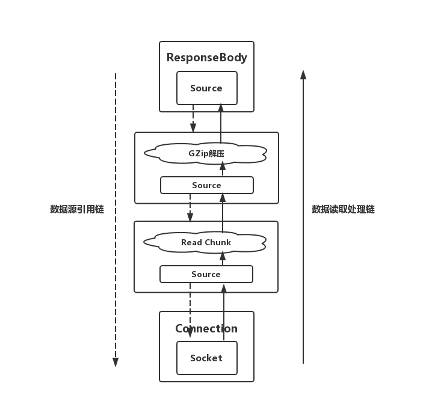
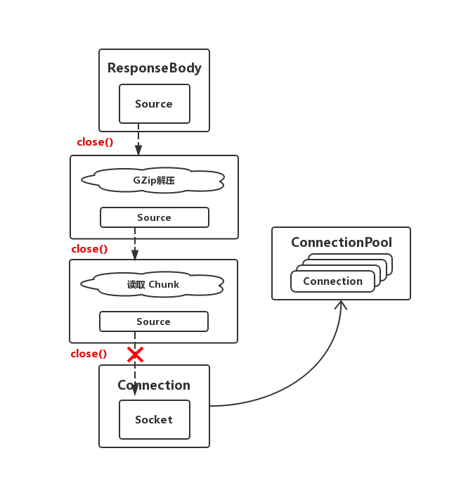
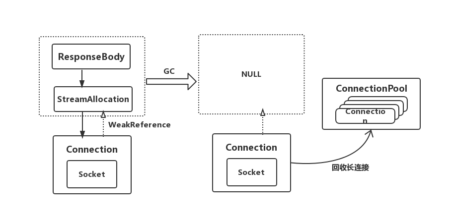

# 记录OkHttp引起的崩溃 & 对OkHttp资源回收的分析

## 崩溃现象

崩溃现象是项目运行一段时间后会出现随机崩溃，没有固定的复现条件，崩溃Logcat是报在native层的。

```
A/DEBUG: ABI: 'arm64'
A/DEBUG: pid: 30784, tid: 30919, name: RxCachedThreadS  >>> pacage name <<<
A/DEBUG: signal 6 (SIGABRT), code -6 (SI_TKILL), fault addr --------
A/DEBUG: Abort message: 'FORTIFY: FD_SET: file descriptor >= FD_SETSIZE'
A/DEBUG:     x0   0000000000000000  x1   00000000000078c7  x2   0000000000000006
```

从崩溃信息看主要内容是`FORTIFY: FD_SET: file descriptor >= FD_SETSIZE`，在网上大致查询了一下是因为fd文件描述符没有释放导致的，一般都是File或者Socket相关的资源文件没有及时close导致的。

## 猜测原因

OkHttp（v3.8.0）底层是使用Socket进行Http请求的，因此猜测是OkHttp的链接池中的长连接没有释放导致的问题。

于是验证，写了一个循环发送100次请求，来看是否是OkHttp请求导致的。

### Step1 记录发送请求前的fd
在发送请求前查看自己项目进程下的fd数量（需要root的手机或者模拟器）
```
mido:/ # ps -ef | grep you.package.name
u0_a85       16130  1542 0 11:13:01 ?     00:00:45 you.package.name
```
找到进程号是`16130`，到对应目录查看发送请求前的fd数量
```
mido:/ # cd /proc/16130/fd

mido:/proc/16130/fd # ls -l | wc -l
181
```
发现当前项目对应进程的fd持有数量大约是181个

### Step2 记录发送请求后的fd

```
mido:/proc/16130/fd # ls -l | wc -l
430
```
发现确实fd数量骤增，而且会存在很长一段时间，而此时短时间重复发送1000次请求左右(不同手机不一样)，应用就会发生崩溃

## 修改
查看了一下是因为项目中封装了的自定义的Converter中读取数据时没有对ResponseBody进行释放（close）导致的。

原代码如下
```
class FormObjectResponseConverter<T>(
        val gson: Gson,
        val responseType: Type,
        val adapter: TypeAdapter<T>,
        val annotations: Array<Annotation>
) : Converter<ResponseBody, T> {
    override fun convert(responseBody: ResponseBody): T? {
        if (isSpecilRequest(annotations)) {
            ...
        } else {
            return if (String::class.java == responseType) {
                // 调用string方法时responseBody会帮我们close
                responseBody.string() as T
            } else {
                val jsonReader = gson.newJsonReader(responseBody.charStream())
                // 读取完后没有调用 responseBody.close()
                adapter.read(jsonReader)
            }
        }
    }
}
```
这里就是我将responseBody的数据读取并且反序列化成对应对象时没有及时调用`responseBody.close()`导致的；而上述请求`responseBody.string()`方法内部就会帮我们自动close因此不会有问题。

修改方法，最简单的就是全局套一个`try finally`块，在finally块中加上`responseBody.close()`,当然也可以用Kotlin封装的`use`方法

## 其它情况

另外需要注意的是这种情况，我们会在自定义的Interceptor中嵌套封装原ResponseBody做一些附加操作（如加解密）

```
class EncryptResponseBody(val sourceResponseBody: ResponseBody) : ResponseBody() {
    private val sourceResponseContent = Buffer()
    private var isReadData = false
    ...
    override fun source(): BufferedSource {
        if (!isReadData) {
            isReadData = true
            val responseContent = sourceResponseBody.string()
            ... //读取解密数据然后做返回
            sourceResponseContent.write(responseJsonObj.toString().toByteArray())
        }
        return sourceResponseContent
    }
}
```
如上，也是项目中封装的一个统一对请求内容解密的ResponseBody，在调用string()或其他方式读取数据时会对加密的内容先进行一次解密然后再返回，此时也很容易忽略对sourceResponseBody的释放。

这里建议重写自定义ResponseBody类的close方法，在方法内去关闭原ResponseBody，修改代码如下;

```
class EncryptResponseBody(val sourceResponseBody: ResponseBody) : ResponseBody() {
    private val sourceResponseContent = Buffer()
    private var isReadData = false
    ...
    override fun source(): BufferedSource {
        if (!isReadData) {
            isReadData = true
            val responseContent = sourceResponseBody.string()
            ... //读取解密数据然后返回
            sourceResponseContent.write(responseJsonObj.toString().toByteArray())
        }
        return sourceResponseContent
    }

    //重写close方法并且回收资源
    override fun close() {
        super.close()
        sourceResponseBody.close()
    }
}
```

## OkHttp(3.8.0)连接资源释放机制
OkHttp最后默认返回的是一个ResponseBody给我们，而这个ResponseBody是对Socket对inputStream的封装，中间存在多层封装（如GzipSource、ChunkedSource），这里简单的称这种封装单元为一个Source或者数据源。而他们的工作原理就是当ResponseBody读取数据时，会问下层Source要数据，下层Source会问下下层要数据，最后底层的Source则是Socket了，在获得数据后再层层处理并且返回给上层，逻辑类似RxJava的响应式。



每层的Source都间接引用着下层都数据源Source，最后引用到了长链接Connection也就是Socket。因此在不主动释放到情况下会一直持有着Socket。

而主动释放就是通过close方法，close方法会层层调用下层Source的close方法，直到Socket前一层的Source会释放对Socket的引用，这样Socket就可以重新被回收到连接池以备下次的复用。



**疑问：如果ResponseBody不主动close，而是随着对象的回收（如Activity的销毁）一起回收了是否就没有问题了？**

会存在一定问题，因为OkHttp会在请求创建时会持有并监控处理请求的Socket通道，如果不主动close，OkHttp会认为当次请求任务还没有结束，或者还有没读完的数据在InputStream中，因此暂时不会回收复用这个Socket。

如果当前Activity页面或者某个对象持有过多的`ResponseBody`不close则会出现开头的native崩溃。

不过假如OkHttp发现上层的引用对象也就是`ResponseBody`对象被gc回收了，此时OkHttp会主动去回收对应的Socket连接。

源码如下：

```
  private int pruneAndGetAllocationCount(RealConnection connection, long now) {
    List<Reference<StreamAllocation>> references = connection.allocations;
    for (int i = 0; i < references.size(); ) {
      Reference<StreamAllocation> reference = references.get(i);

      //检查引用是否为null
      if (reference.get() != null) {
        i++;
        continue;
      }
      // 此时发现对上层的弱引用为null了表示上层gc了，但是还没有主动close释放长连接
      // 这种情况判断为是应用程序自己的问题，这里直接进行对长连接的回收
      // We've discovered a leaked allocation. This is an application bug.
      StreamAllocation.StreamAllocationReference streamAllocRef =
          (StreamAllocation.StreamAllocationReference) reference;
      String message = "A connection to " + connection.route().address().url()
          + " was leaked. Did you forget to close a response body?";
      Platform.get().logCloseableLeak(message, streamAllocRef.callStackTrace);

      references.remove(i);
      //标记长链接可以被回收了
      connection.noNewStreams = true;

      ...
    }

    return references.size();
  }
}
```
Connection会通过`WeakReference`弱引用接持有`StreamAllocation`,而`ResponseBody`则会间接的持有`StreamAllocation`，通过检查`StreamAllocation`弱引用是否为null来判断`StreamAllocation`和`ResponseBody`是否被gc了，如果被gc了则回收长连接。因此可以知道在使用OkHttp时建议及时读取ResponseBody中的数据，并且主动Close释放对Socket的引用



## 总结
在使用OkHttp一定要记得调用close来释放ResponseBody。
