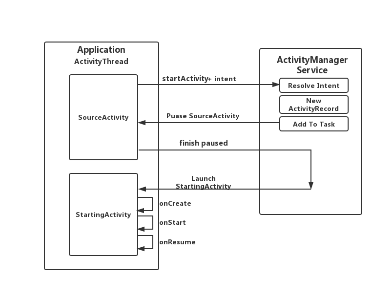
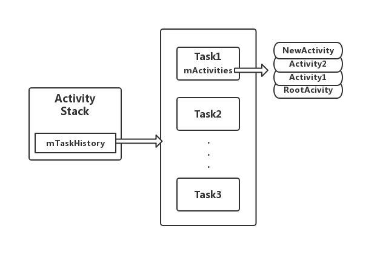
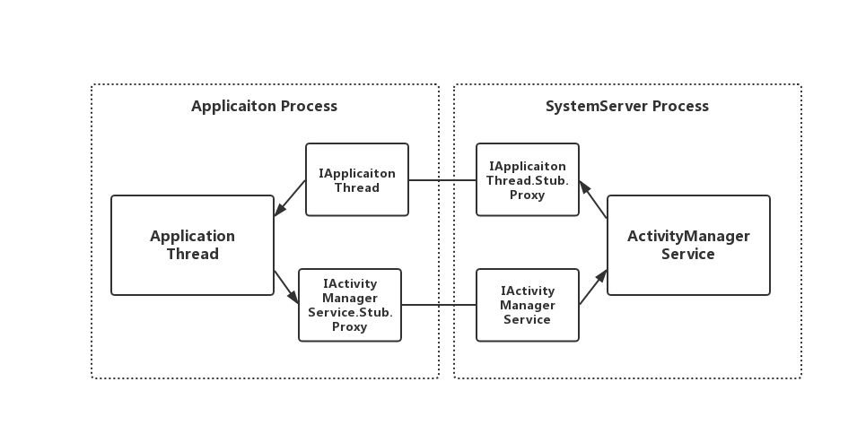
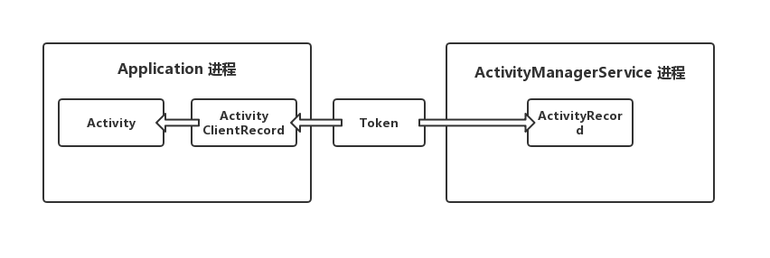
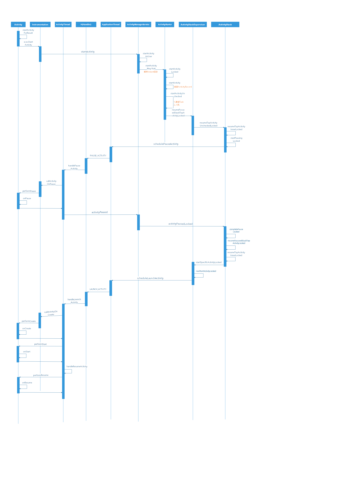

#StartActivity
## 提纲
> * StartActivity整体流程概括
> 
>   1. ActivityThread模块与AMS交互，图文
>   2. 关键问题提出
>      
>       1. ActivityThread和AMS之间Activity的映射关系
>       2. SourceActivity和StartingActivity之间生命周期的变化
>       3. Stack & Task 何时入栈 setTaskFromSourceRecord
> 
> * StartActivity源码细节
> 
>   0. 整体调用流程图
>   1. Client端Activity发起startActivity
>   2. AMS解析intent
>   3. ActivityRecord
>   4. 启动模式的判断（忽略）
>   5. Stack & Task (何时入栈)
>   6. Pause SourceActivity
>   7. 创建启动StartingActivity
>   8. Stop SourceActivity
>
> * StartActivity流程图
> * 总结
> 

## 0. 前言
整理这篇文章的目的是在回顾时可以通过文章提到的主干流程回忆扩展完整的只是结构，分析过程会比较**精简**，只要能够帮助自己复盘即可。

## 1. StartActivity逻辑图
Activity的启动流程涉及到IPC跨进程通讯，主要关联Application所在进程以及AMS进程。交互流程图如下




* StartActivity整个过程类似与一个C/S架构，Application担任Client端，ActivityManagerService担任Server端
* ActivityManagerService管理者所有应用的Activity的状态以及回退栈，而Application只是ActivityManagerService在其中一个进程中具体表现
* StartActivity的过程中永远是启动者Activity优先进入Pause阶段，而后再创建新Activity


## 2. StartActivity中的一些疑问
1. **Activity作为Client端表现，那么它在ActivityManagerService的表现上形式是什么？**
2. **如何确定一个Activity在Application端和AMS端的映射关系？**
3. **Stack和Task的概念，它们有什么区别？**
4. **整个启动过程中Activity的生命周期是如何发生变化的，是否有序？**
5. **为什么StartActivity的过程需要以C/S的形式来实现？**

围绕上述问题和流程图来继续分析StartActivity的源码

## 3. 源码分析(API-27)
StartActivity的源码流程可以总结为5步：
* 发起StartActivity请求
* 创建ActivityRecord
* 寻找栈 & 入栈
* 准备启动 —— call pause
* 启动Activity


### 3.1 Application发起startActivity请求   
```
    // [CODE]android.app.Activity
     public void startActivity(Intent intent, @Nullable Bundle options) {
        if (options != null) {
            startActivityForResult(intent, -1, options);
        } else {
            startActivityForResult(intent, -1);
        }
    }

    public void startActivityForResult(@RequiresPermission Intent intent, int requestCode,
            @Nullable Bundle options) {
            ...
                mInstrumentation.execStartActivity(
                    this, mMainThread.getApplicationThread(), mToken, this,
                    intent, requestCode, options);
            ...
    }
```
```
    // [CODE]android.app.Instrumentation
    public ActivityResult execStartActivity(
            Context who, IBinder contextThread, IBinder token, Activity target,
            Intent intent, int requestCode, Bundle options) {
        ...
            int result = ActivityManager.getService()
                .startActivity(whoThread, who.getBasePackageName(), intent,
                        intent.resolveTypeIfNeeded(who.getContentResolver()),
                        token, target != null ? target.mEmbeddedID : null,
                        requestCode, 0, null, options);
        ...                
        return null;
    }
```
Activity执行startActivity方法最终会跨进程调用ActivityManagerService的startActivity，作为参数的intent中包含着Application需要启动的Activity的信息。此过程Application的任务就是组装参数（intent），并且跨进程发起请求。

### 3.2 AMS创建ActivityRecord
#### 3.2.1 解析Intent中的参数
```
    // [CODE]com.android.server.am.ActivityStarter
    final int startActivityMayWait(IApplicationThread caller, int callingUid,
            String callingPackage, Intent intent, IBinder resultTo...) {
                ...
                //调用PackageManagerService来解析Intent
                ResolveInfo rInfo = mSupervisor.resolveIntent(intent, resolvedType, userId); 

                //从Intent解析获取的信息中解析处待启动的Activity信息
                ActivityInfo aInfo = mSupervisor.resolveActivity(intent, rInfo, startFlags, profilerInfo);

                int res = startActivityLocked(caller, intent, aInfo, 
                                                rInfo, resultTo, resultWho, requestCode...);
                ...
    }
```
AMS会调用PackageManagerService来解析Intent中的数据，其中包括带启动Activity的信息以及Manifes中对应的配置，解析完Itent并且获得对应Activity信息后就开始准备创建ActivitRecord；

#### 3.2.2 创建ActivityRecord
```
    // [CODE]com.android.server.am.ActivityStarter
    private int startActivity(IApplicationThread caller, Intent intent, 
                                ActivityInfo aInfo, ResolveInfo rInfo, 
                                IBinder resultTo, String resultWho...) {
        ...
                                    
        ActivityRecord r = new ActivityRecord(mService, callerApp, callingPid, callingUid,
                callingPackage, intent, resolvedType, aInfo, mService.getGlobalConfiguration(),
                resultRecord, resultWho, requestCode, componentSpecified, voiceSession != null,
                mSupervisor, options, sourceRecord);       

        ...

        return startActivity(r, sourceRecord, voiceSession, voiceInteractor, startFlags, true,
                options, inTask, outActivity);
    }
```

Activity类是作为Application端也就是Client端展现的形式，而对应在AMS中Activity则是以ActivityRecord类的形式展现，ActivityRecord可以理解为Application中Activity的映射。

Application中的Activity和AMS中的ActivityRecord是一一对应的关系。

以下是Activity的构造方法参数供以后查阅：
```
[type]                      [name]                      [description]
ActivityManagerService      _service                    AMS对应的实例
ProcessRecord               _caller                     根据Activity.startActivity传入的IApplicationThread映射找到的
int                         _launchedFromPid            调用方sourceActivity所在的进程id
int                         _launchedFromUid            调用方sourceActivity所在进程的uid
Intent                      _intent                     intent
String                      _resolveType                Intent.resolveTypeIfNeeded(activity.getContentResolver()) //暂时不明白有什么用
ActivityInfo                aInfo                       解析Manifest获得的信息描述对象
Configuration               _configuration              AMS.getGlobalConfiguration()
ActivityRecord              _resultTo                   null //有什么意义吗？和resultWho有什么区别
String                      _resultWho                  sourceActivity.mEmbeddedID //暂时不明确是什么 唯一id？
int                         _reqCode                    requestCode -1
boolean                     _componentSpecified         intent.getComponent() != null, true
boolean                     _rootVoiceInteraction       false
ActivityStackSupervisor     supervisor                  调用基础方法的执行对象
ActivityContainer           container                   null
ActivityOption              options                     ActivityOptions.fromBundle(bOptions)
ActivityRecord              sourceRecord                发起startActivity的Activity对应的ActivityRecord
```

### 3.3 入栈
#### 3.3.1 Stack & Task
Android中所有Activity都归Stack(间接)管理，主要是为了实现Activity的新加入后回退。在Android中它的实现形式是ActivityStack类。

##### Stack ActivityStack
ActivityStack保证Activity先进先出（FIFO）的顺序的基础上以Task为单位来管理Activity。

```com.android.server.am.ActivityStack
// [CODE]com.android.server.am.ActivityStarter
ActivityRecord findActivityLocked(Intent intent, ActivityInfo info,
                                    boolean compareIntentFilters) {
    ...
    for (int taskNdx = mTaskHistory.size() - 1; taskNdx >= 0; --taskNdx) {
        //
        final TaskRecord task = mTaskHistory.get(taskNdx);
        final ArrayList<ActivityRecord> activities = task.mActivities;
        for (int activityNdx = activities.size() - 1; activityNdx >= 0; --activityNdx){
            ...
        }
    }
    return null;
}
```
上面是一个ActivityStack类中的其中一个查找Activity的方法，从方法中可以看出ActivityStack想要找到指定的Activity需要先遍历Stack中的所有Task（ActivityStack.mTaskHistory）,然后再从栈中获取所有Activity（TaskRecord.mActivities）。从上述方法可以看出ActivityStack在管理Activity的形式并非是直接管理的。

##### Task TaskRecor
Task在Android中是直接管理Activity的容器，Task秉承Activity先进先出的顺序，是ActivityStack的具体细节体现。TaskRecor则是描述Task抽象概念的一个具体实现类。

Activity在被压入Task时虽然遵循FIFO原则但并非只是一个一个压入一个一个弹出，根据Activity不同的启动模式（LaunchMode）可以定制Activity在Task中的行为，如单例（SingTask），单例单栈（SingInstance）等。

Activity不能脱离Task存在，任何一个Activity都会被放置在一个Task中，默认放置在启动者相同的栈中。

##### Task & Stack & Activity 关系


关系：
* Stack通过`mTaskHistory`管理Task
* Task通过`mActivities`管理Activity
* Task遵循FIFO，是Stack栈形式的体现

 ActivityStack利用Task这一个中间层管理Acitivty带来了跟多的灵活性，Activity并非只能死板的先进先出，而是可以以任务组Task的形式来切换任意一组的Task（以及Task包含的Activity）到前台或者后台。

#### 3.3.2 寻找新Activity的位置
StartActivityUncheck单独整理在《LaunchMode篇》

#### 3.3.3 压入目标栈
```
// [CODE]com.android.server.am.ActivityStarter

private int startActivityUnchecked(final ActivityRecord r, ActivityRecord 
                        sourceRecord,  boolean doResume, TaskRecord inTask ...) {
    ...
    // mStartActivity待启动Activity，mSourceRecord启动者Activity（mSourceRecord严格上说并非是启动者，它可能会被替换）
    if (mStartActivity.resultTo == null && mInTask == null && !mAddingToTask
            && (mLaunchFlags & FLAG_ACTIVITY_NEW_TASK) != 0) {
        // 1.需要创建并加入到一个Task中     
        newTask = true;
        result = setTaskFromReuseOrCreateNewTask(
                taskToAffiliate, preferredLaunchStackId, topStack);
    } else if (mSourceRecord != null) {
        // 2.加入到启动者相同的task
        result = setTaskFromSourceRecord();
    } else if (mInTask != null) {
        // 3.需要加入一个指定Task的情况    
        result = setTaskFromInTask();
    }
}

private int setTaskFromSourceRecord() {
    ...
    addOrReparentStartingActivity(sourceTask, "setTaskFromSourceRecord");
    return START_SUCCESS;
}

private void addOrReparentStartingActivity(TaskRecord parent, String reason) {
    ...
    parent.addActivityToTop(mStartActivity);
}
```
Activity在入栈时一般会有三种可能：
1. 创建一个新的栈并且放入，如Luancher启动的Activity
2. 加入到一个已有的Task栈(mSourceActivity.getTask())中，如普通启动时加入到当前启动者对应栈中，FLAG_ACTIVITY_NEW_TASK或者SingleTask等时寻找一个已经存在的合适的栈加入。
3. 加入到一个指定的栈中，这种情况比较少

这里默认就按照最普通的情况，新Activity和启动者位于同一Task的情况来分析，在确定Task后最会将新启动的Activity（ActivityRecord）压入到Task的顶部（特定情况除外），也就是加入到mActivities列表的末尾。

### 3.4 启动前准备
#### 3.4.1 AMS通知Application去Pause当前正在显示的Activity
回顾一下之前AMS所作的工作：
1. 配合PackageManagerService解析startActivity的请求发送的intent
2. 根据解析结果创建了待启动Activity的ActivityRecord
3. 将新Activity入栈，插入到对应的Task顶部

接下来的工作就是为启动新Activity做准备工作——Paued当前正在显示的Activity
```
    // [CODE]com.android.server.am.ActivityStarter

    private int startActivityUnchecked(final ActivityRecord r, ActivityRecord 
                            sourceRecord,  boolean doResume, TaskRecord inTask ...) {
        ...
        if (mDoResume) {
            ...
            mSupervisor.resumeFocusedStackTopActivityLocked(mTargetStack, mStartActivity,
                    mOptions);
        }
    }
```
```
    // [CODE]com.android.server.am.ActivityStackSupervisor

    private boolean resumeTopActivityInnerLocked(ActivityRecord prev, ActivityOptions options) {
        ...
        boolean pausing = mStackSupervisor.pauseBackStacks(userLeaving, next, false);
        // mResumedActivity表示当前栈中正在显示的Activity
        if (mResumedActivity != null) {
            pausing |= startPausingLocked(userLeaving, false, next, false);
        }
        //resumeWhilePausing标志代表启动Activity的时候是否等前一个Pause以后才正式开始启动
        //默认一般都是false
        if (pausing && !resumeWhilePausing) {
            return true;
        }
    }  
    
    final boolean startPausingLocked(boolean userLeaving, boolean uiSleeping,
            ActivityRecord resuming, boolean pauseImmediately) {
        ...

        //获取栈中正在显示的Activity        
        ActivityRecord prev = mResumedActivity;

        if (prev.app != null && prev.app.thread != null) {
                //调用正在显示的Activity执行schedulePauseActivity
                prev.app.thread.schedulePauseActivity(prev.appToken, prev.finishing,
                        userLeaving, prev.configChangeFlags, pauseImmediately);
        } 
```
AMS判断当前是否有Acitvity正在显示，如果有正在显示的Activity则会取出ActivityRecor的Application对应的IApplicationThread远程接口告诉Application进程去Pause那个正在显示的Activity。

IApplicationThread专门用于接收AMS分配的任务是一个Binder对象，可以理解为IApplicationThread是一个进程开放给AMS的回调接口。AMS在处理Activity的过程中如要launch，pause，stop Activity都需要通过这个接口来告诉Application执行相应的操作。



如上图描述Application和AMS通讯的过程

**思考：跨进程如何从Stub(BBinder)自动转为Stub.Proxy(BpBinder)的，底层怎么知道Stub对应的是哪个Stub.Proxy**

#### 3.4.2 Activity唯一标志——Token
之前AMS调用IApplicationThread.schedulePauseActivity时有一个关键的参数`prev.appToken`也就是ActivityRecord.appToken,它是Activity的唯一标识，它的作用是告诉Application进程具体需要Pause哪个Activity。

Token是伴随着ActivityRecord创建时一同创建的，并且Token内部同时持有着ActivityRecord的弱引用
```
// [CODE]com.android.server.am.ActivityRecord
ActivityRecord(ActivityManagerService _service, ProcessRecord _caller, int _launchedFromPid,
        int _launchedFromUid, String _launchedFromPackage, Intent _intent, String _resolvedType,
        ActivityInfo aInfo, Configuration _configuration,
        ActivityRecord _resultTo, String _resultWho, int _reqCode,
        boolean _componentSpecified, boolean _rootVoiceInteraction,
        ActivityStackSupervisor supervisor, ActivityOptions options,
        ActivityRecord sourceRecord) {
    service = _service;
    appToken = new Token(this);
    ...
}        
```
```
// [CODE]android.app.ActivityThread
static class Token extends IApplicationToken.Stub {
    private final WeakReference<ActivityRecord> weakActivity;

    Token(ActivityRecord activity) {
        weakActivity = new WeakReference<>(activity);
    }

    private static ActivityRecord tokenToActivityRecordLocked(Token token) {
        if (token == null) {
            return null;
        }
        ActivityRecord r = token.weakActivity.get();
        if (r == null || r.getStack() == null) {
            return null;
        }
        return r;
    }
}
```
在Application进程ActivityThread(专门用于处理IApplicationThread接收到的AMS回调的类)中同时存在一份关于Token的映射Map
```
// [CODE]android.app.ActivityThread
public final class ActivityThread {
    final ArrayMap<IBinder, ActivityClientRecord> mActivities = new ArrayMap<>();
    ...
}
```
而一般Application进程获取一个由AMS指定的Activity一般是如下形式：
```
//1.根据token获取对应的ActivityClientRecord
 ActivityClientRecord r = mActivities.get(token);
 if (r != null) {
     //2.从ActivityClientRecord获取对应的Activity
     Activity activity =  r.activity
 }
```

从上面可以发现Token是关联Application进程和AMS进程的桥梁。



**思考：跨进程如何确保每次传过来的Binder对象的唯一性,从Parcelable读取Binder对象的方法去寻找答案**

#### 3.4.2 finishPause
```
// [CODE] android.app.ActivityThread
final H mH = new H();

 private class ApplicationThread extends IApplicationThread.Stub {

        public final void schedulePauseActivity(IBinder token, boolean finished,
        boolean userLeaving, int configChanges, boolean dontReport) {
            ...

        sendMessage(
                finished ? H.PAUSE_ACTIVITY_FINISHING : H.PAUSE_ACTIVITY,
                token,
                (userLeaving ? USER_LEAVING : 0) | (dontReport ? DONT_REPORT : 0),
                configChanges,
                seq);
 }

 private class H extends Handler {
     public void handleMessage(Message msg) {
        switch (msg.what) {
            ...
            case PAUSE_ACTIVITY: {
                handlePauseActivity((IBinder) args.arg1, false,
                        (args.argi1 & USER_LEAVING) != 0, args.argi2,
                        (args.argi1 & DONT_REPORT) != 0, args.argi3);
           } break;

     }


```
此时来到Application所在的进程ApplicationThread接收到了AMS的schedulePauseActivity回调后会想H发送一个消息，而H就是一个主线程的Handler，切换到主线程后执行真正的Pause操作。

```
    // [CODE] android.app.ActivityThread
    private void handlePauseActivity(IBinder token, boolean finished,
            boolean userLeaving, int configChanges, boolean dontReport, int seq) {
        //根据token找到指定的Activity
        ActivityClientRecord r = mActivities.get(token);

        if (r != null) {
            //方法去调用Activity的onPause回调
            performPauseActivity(token, finished, r.isPreHoneycomb(), "handlePauseActivity");

            //dontReport对应AMS调用schedulePauseActivity时的参数pauseImmediately也就是false
            if (!dontReport) {
                //告诉AMS对应的Activity已经Paused结束了
                ActivityManager.getService().activityPaused(token);
            }
        }
    }

```
在回调Activity的pause以后Pause流程结尾继续回调AMS`activityPaused()`，并将当前Pause的Activity对应token回传给AMS；

### 3.5 启动新Activity

#### 3.5.1 通知AMS Pause结束
在Application结束Activity Pause流程后回到AMS中
```
public class ActivityManagerService extends IActivityManager.Stub
        implements Watchdog.Monitor, BatteryStatsImpl.BatteryCallback {

    ...        
    @Override
    public final void activityPaused(IBinder token) {
        ...
        stack.activityPausedLocked(token, false);
    }
    ...
}

final void activityPausedLocked(IBinder token, boolean timeout) {
    ...
    final ActivityRecord r = isInStackLocked(token);
    if (r != null) {
        completePauseLocked(true /* resumeNext */, null /* resumingActivity */);
    }    
}

private void completePauseLocked(boolean resumeNext, ActivityRecord resuming) {
    ...
    if (resumeNext) {
        //重新开始启动顶部的Activity
        mStackSupervisor.resumeFocusedStackTopActivityLocked();
    }    
}    
```
此时AMS会重新找到之前顶部的Activity,也就是之前放到Stack顶部的Task中的最上面的新Activity。

#### 3.5.2 回调Application launch新Activity
```
private boolean resumeTopActivityInnerLocked(ActivityRecord prev, ActivityOptions options) {
    ...
    //获取待启动Activity
    final ActivityRecord next = topRunningActivityLocked(true /* focusableOnly */);

    //再检查一遍是否还有未Pause的Activity，一般情况下都已经Pause了
    boolean pausing = mStackSupervisor.pauseBackStacks(userLeaving, next, false);
    if (mResumedActivity != null) {
        pausing |= startPausingLocked(userLeaving, false, next, false);
    }

    if (next.app != null && next.app.thread != null) {
        ...
    } else {
        //准备启动新的Activity
        mStackSupervisor.startSpecificActivityLocked(next, true, true);
    }
}    
```

    void startSpecificActivityLocked(ActivityRecord r,
            boolean andResume, boolean checkConfig) {
        //尝试获取Application对应的进程描述
        ProcessRecord app = mService.getProcessRecordLocked(r.processName,
                r.info.applicationInfo.uid, true);
        if (app != null && app.thread != null) {
                //获取到了则准备启动Activity
                realStartActivityLocked(r, app, andResume, checkConfig);
                return;
        }
        //未获取到，说明需要启动一个新的Application进程
        mService.startProcessLocked(r.processName, r.info.applicationInfo, true, 0,
                "activity", r.intent.getComponent(), false, false, true);
    }

此时重新检查一遍栈的状态，确保一切状态正常（此时假设Applicaiton已经是存在的），最后调用`realStartActivityLocked`去启动通知Applicaiton启动Activity。

```
final boolean realStartActivityLocked(ActivityRecord r, ProcessRecord app,
            boolean andResume, boolean checkConfig) throws RemoteException {
    ...
    r.app = app;
    //启动Activity
    app.thread.scheduleLaunchActivity(new Intent(r.intent), r.appToken,
                        System.identityHashCode(r), r.info,
                        mergedConfiguration.getGlobalConfiguration(),
                        mergedConfiguration.getOverrideConfiguration(), r.compat,
                        r.launchedFromPackage, task.voiceInteractor, app.repProcState, r.icicle,
                        r.persistentState, results, newIntents, !andResume,
                        mService.isNextTransitionForward(), profilerInfo);
    ...
}
```
此时通过ApplicaitonThread的远程接口回调scheduleLaunchActivity并且将对应启动时的Intent和token等传给ApplcationThread；

#### 3.5.3 Application launch新Activity
```
    private class ApplicationThread extends IApplicationThread.Stub { 
        ...
        @Override
        public final void scheduleLaunchActivity(Intent intent, IBinder token, int ident,
                ActivityInfo info, Configuration curConfig, Configuration overrideConfig,
                CompatibilityInfo compatInfo, String referrer, IVoiceInteractor voiceInteractor,
                int procState, Bundle state, PersistableBundle persistentState,
                List<ResultInfo> pendingResults, List<ReferrerIntent> pendingNewIntents,
                boolean notResumed, boolean isForward, ProfilerInfo profilerInfo) {
            //创建一个新的Application端Activity的描述，记录Activity的基本信息，并且把token存下来
            ActivityClientRecord r = new ActivityClientRecord();
            r.token = token;
            r.ident = ident;
            r.intent = intent;
            ...
            sendMessage(H.LAUNCH_ACTIVITY, r);
        }
    }

    private class H extends Handler {
        public void handleMessage(Message msg) {
            switch (msg.what) {
                case LAUNCH_ACTIVITY: {
                    final ActivityClientRecord r = (ActivityClientRecord) msg.obj;
                    handleLaunchActivity(r, null, "LAUNCH_ACTIVITY");
                } break;
            }    
        }
    }

    private void handleLaunchActivity(ActivityClientRecord r, Intent customIntent, String reason) {
        
        Activity a = performLaunchActivity(r, customIntent);

        handleResumeActivity(r.token, false, r.isForward,
                    !r.activity.mFinished && !r.startsNotResumed, r.lastProcessedSeq, reason);
    }
```
Application端在接收到AMS的回调后会根据token创建一个新的ActivityClientRecord描述，并且通过Handler发送消息切换到主线程调用`performLaunchActivity()`方法去创建Activity。

```
private Activity performLaunchActivity(ActivityClientRecord r, Intent customIntent) {
    //获取Activity对应的类名
    ComponentName component = r.intent.getComponent();
    ...
    /**
     * mInstrumentation.newActivity的实现就是通过反射创建Activity实例，如下
     * (Activity)cl.loadClass(className).newInstance();
     */ 
    activity = mInstrumentation.newActivity(cl, component.getClassName(), r.intent);
    ...
    //回调Activity.onCreate方法
    mInstrumentation.callActivityOnCreate(activity, r.state);
    //回调Activity.onStart方法    
    activity.performStart();
    ...
    //以token为key来缓存ActivityClientRecord描述
    mActivities.put(r.token, r);
}

private void handleLaunchActivity(ActivityClientRecord r, Intent customIntent, String reason) {
        
        Activity a = performLaunchActivity(r, customIntent);
        //执行Activity的Resume逻辑并且回调Activity的onResume方法
        handleResumeActivity(r.token, false, r.isForward,
                    !r.activity.mFinished && !r.startsNotResumed, r.lastProcessedSeq, reason);
}
```
Activity通过Intent中记录的信息来反射创建Activity实例，创建完成后依次回调onCreate，onStart,onResume生命周期。

最后在确保顺利创建完成后会将对应的`ActivityClientRecord`以Token为key缓存到`mActivities`中，确保下次AMS能够通知Application找到正确的Activity并执行对应方法。
 
## 4. StartActivity流程图




## 5. 总结StartActivity的架构