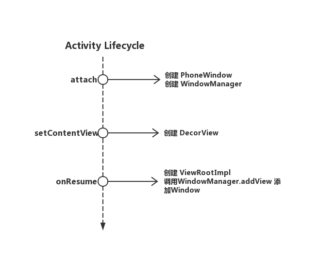
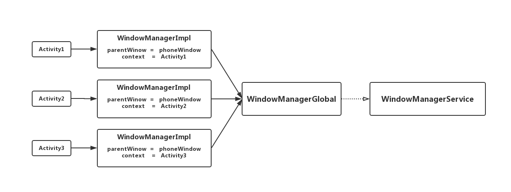
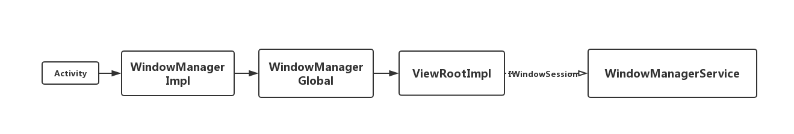

# WindowManagerService笔记
## 提纲
> * Window的添加及管理
> 
>   1. Activity中与Winow相关的生命周期图
>   2. Activity与WindowManager的关系
>   3. Activity的Window的添加过程
>      
>       1. WindowManager.addView
>       2. ViewRootImpl.setView
>       3. ViewRootImpl和WindowManager的通讯
>   
>   4. Dialog的Window添加过程
>
> * Token的对应关系
> 

## Window的添加过程

### 1. Activity中与Winow相关的生命周期图



具体Window相关的步骤发生的生命周期就是这三个，第三个onResume严格的说应该是执行完onResume回调后进行的操作。

### 2. Activity与WindowManager的关系

WindowManager是一个以Activity为作用域的Window代理对象，它的实现类是WindowManagerImpl。每个Activity都有一个属于自己的WindowManager对象，而WindowManagerImpl在处理Activity的任务时如添加Window，并不是自己来完成的，而是交给一个叫做WindowManagerGlobal的全局单例来完成的，WindowManagerGlobal在接收到WindowManagerImpl的请求后才回去直接或者间接的和WindowManagerService通讯。

```
    // [CODE]android.view.Window.java

    public void setWindowManager(WindowManager wm, IBinder appToken, String appName,
            boolean hardwareAccelerated) {
        // 参数WindowMangerImpl是从ContextImpl创建获取的
        // 由这个WindowMangerImpl来创建一个新的WindowManagerImpl
        mWindowManager = ((WindowManagerImpl)wm).createLocalWindowManager(this);
    }

    public WindowManagerImpl createLocalWindowManager(Window parentWindow) {
        // 创建来一个新的WindowManagerImple
        return new WindowManagerImpl(mContext, parentWindow);
    }

```
在Window被设置来对应的WindowManagerImpl后，对应的Activity也会被设置上这个WidnowManagerImple，从源码可以知道每个Activity持有的WindowManager都是独立的新构造的，Activity、WindowManager、WindowManager三者的关系如下：




### 3. Activity的Window的添加过程

####  3.1 WindowManager.addView
Activity在attch过程中创建来一个PhoneWindow对象，在ActivityThread的handleResumeActivity过程中会通过WindowManagerImpl来将这个Window添加到WindowManagerService中。具体流程如下：
```
    // [CODE]android.app.ActivityThread.java

    final void handleResumeActivity(IBinder token,
            boolean clearHide, boolean isForward, boolean reallyResume, int seq, String reason) {
                ...
                ViewManager wm = a.getWindowManager();
                if (!a.mWindowAdded) {
                        a.mWindowAdded = true;
                        wm.addView(decor, l);
                    }
                ...
    }
```

```
    // [CODE]android.view.WindowManagerImpl.java

    @Override
    public void addView(@NonNull View view, @NonNull ViewGroup.LayoutParams params) {
        applyDefaultToken(params);
        mGlobal.addView(view, params, mContext.getDisplay(), mParentWindow);
    }

```

```
    // [CODE]android.view.WindowManagerGlobal.java

    public void addView(View view, ViewGroup.LayoutParams params,
                Display display, Window parentWindow) {

                ...
                ViewRootImpl root;
                root = new ViewRootImpl(view.getContext(), display);
                
                root.setView(view, wparams, panelParentView);
            
                ...
            }
        }
```
从上面三段代码可以知道，ActivityThread在handleResumeActivity到过程中调用Activity对应到WindowManagerImpl调用addView，接着再委托给WindowManagerGlobal，最后创建来一个ViewRootImpl并调用setView来完成Window的添加。


#### 3.2 ViewRootImpl
ViewRootImpl中包含着一个IWindowSession对象用于和WindowManagerService通讯，IWindowSession对象是进程单例，全局只有一个。

```
    // [CODE]android.view.ViewRootImpl.java

    public ViewRootImpl(Context context, Display display) {
        mContext = context;
        mWindowSession = WindowManagerGlobal.getWindowSession();
    }
```

```
    // [CODE]android.view.WindowManagerGlobal.java

    public static IWindowSession getWindowSession() {
        synchronized (WindowManagerGlobal.class) {
            if (sWindowSession == null) {
                    ...
                    IWindowManager windowManager = getWindowManagerService();
                    sWindowSession = windowManager.openSession(...);
            }
            return sWindowSession;
        }
    }

```
ViewRootImpl可以看作是Activity和WindowManagerService通讯的桥梁纽带。App端和WindowManagerService通讯都需要通过ViewRootImpl内部的IWindowSession对象来完成。

