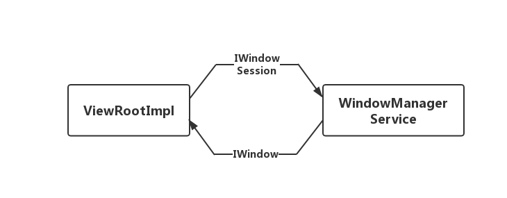
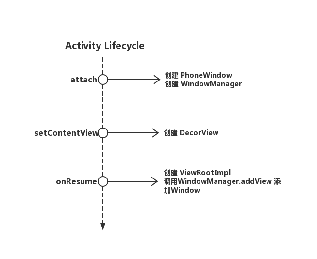
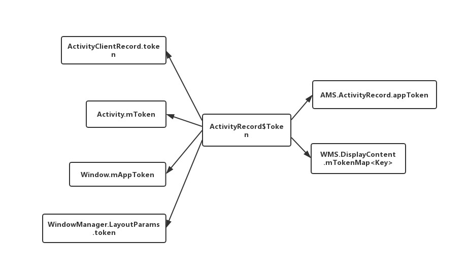

## 提纲
> * Widnow相关的重要组成
>   1. PhoneWindow
>   2. DecorView
>   3. WindManager WindowManagerImpl WindowManagerGlbal
>   4. ViewRootImpl   
>   5. WindowManagerService
> 
> * Window添加流程
>   1. Window添加的整体调用流程图
>   2. Token的映射逻辑
>   3. Window的分组逻辑


## Widnow相关概念
### PhoneWindow
Window是一个界面的抽象概念，用来描述一个界面，它和View类似；

Window通常面向Android服务端，在Andorid中的各种XXXManagerService中对界面的描述通常是以Window的形式来展现。
View通常面向Application端，在App中描述一个界面的组成结构通常以View或者ViewGroup的形式来展现。

Window和View可以说都是界面的具体的表现，而Window更宽泛注重宏观的管理，View更具体注重各个组成部分的细节把控。

PhoneWindow则是Activity界面的抽象描述，对应的View则是DecorView。

Activity的PhoneWindow创建是在Activity创建过程中的attach阶段；
```
// [CODE]android.app.Activity
final void attach(Context context, ActivityThread aThread,
        Instrumentation instr, IBinder token, int ident,
        Application application, Intent intent, ActivityInfo info,
        CharSequence title, Activity parent, String id,
        NonConfigurationInstances lastNonConfigurationInstances,
        Configuration config, String referrer, IVoiceInteractor voiceInteractor,
        Window window, ActivityConfigCallback activityConfigCallback) {
    ...
    mWindow = new PhoneWindow(this, window, activityConfigCallback);
    mWindow.setWindowControllerCallback(this);
    mWindow.setCallback(this);
    mWindow.setOnWindowDismissedCallback(this);
    mWindow.getLayoutInflater().setPrivateFactory(this);
    if (info.softInputMode != WindowManager.LayoutParams.SOFT_INPUT_STATE_UNSPECIFIED) {
        mWindow.setSoftInputMode(info.softInputMode);
    }
    if (info.uiOptions != 0) {
        mWindow.setUiOptions(info.uiOptions);
    }
    ...
}
```

### DecorView
DecorView是Window的顶层View，决定着Window的界面表现。Activity中的DecorView通常包含着title和content两部分；


```
-Decor
--LinearLayout
---ViewStub(title)
---FrameLayout(content)
----ConstraintLayout(xml)
```

DecorView是在onCreateView的setContentView过程中创建的
```
// [CODE]android.app.Activity
public void setContentView(@LayoutRes int layoutResID) {
    getWindow().setContentView(layoutResID);
    initWindowDecorActionBar();
}
```
```
// [CODE]com.android.internal.policy.PhoneWindow
@Override
public void setContentView(int layoutResID) {
    ...
    if (mContentParent == null) {
        installDecor();
    }
    ...
}

private void installDecor() {
    mForceDecorInstall = false;
    if (mDecor == null) {
        mDecor = generateDecor(-1);
        ...
    }
    ...
}

protected DecorView generateDecor(int featureId) {
    ...
    return new DecorView(context, featureId, this, getAttributes());
}
```


### ViewRootImpl
ViewRoot是App端和WindowManagerService通讯的“中介”。
每个Window都拥有一个自己的ViewRootImpl,它负责发送和接收WindowManagerService的请求。

ViewRootImpl内部有两个比较重要的Binder对象，
IWindowSession对象，它是一个BinderProxy（Binder Client端）对象，负责发送App端对应Window的请求，IWindowSession对象进程中只有一个是全局单例的，所有ViewRootImpl共享同一个IWindowSession；
IWindow对象，他是一个Binder（Binder Server端）对象，负责接收来自WindowManagerService发送的请求，每个ViewRootImpl拥有各自的IWindow对象，Window、ViewRootImpl、IWindow对象是一一对应的，因此IWindow对象可以作为不同Window的标志；



ViewRootImpl统一由WindowManagerGlobal统一创建并且管理，ViewRootImpl是在Activity的onResume回调过后创建的，具体代码如下：
```
// [CODE]android.app.ActivityThread
final void handleResumeActivity(IBinder token,
        boolean clearHide, boolean isForward, boolean reallyResume, int seq, String reason) {
            ...
            ViewManager wm = a.getWindowManager();
            if (!a.mWindowAdded) {
                a.mWindowAdded = true;
                wm.addView(decor, l);
            }
            ...
        }
```

```
// [CODE]android.app.WindowManagerImpl
@Override
public void addView(@NonNull View view, @NonNull ViewGroup.LayoutParams params) {
    applyDefaultToken(params);
    mGlobal.addView(view, params, mContext.getDisplay(), mParentWindow);
}
```
```
// [CODE]android.app.WindowManagerGlobal
public void addView(View view, ViewGroup.LayoutParams params,
        Display display, Window parentWindow) {
            ...
            ViewRootImpl root;
            root = new ViewRootImpl(view.getContext(), display);

            mViews.add(view);     // Window对应的DecorView
            mRoots.add(root);     // Window对应的ViewRootImpl
            mParams.add(wparams); // Window对应的LayoutParams
            ...
        }
```

### WindowManagerService
WindowManagerService统一管理Android中所有Window的类，主要负责管理Window的添加删除分组以及层级以及一些辅助操作，如替App申请渲染用的SurfaceFling组件，协助InputManagerService完成一些操作。但是WindowManagerService不负责Window界面的渲染，界面渲染工作主要由SurfaceFling来完成。

App端的Window在WindowManagerService中以WindowState的形式展现，类似ActivityManagerService中ActivityRecord。

### Window各部分创建总结
以Activity的Window创建为例，PhoneWindow、WindowManager、Decor、ViewRootImpl的创建生命周期图如下：



## Window添加流程
### Window添加流程简述
Window的添加流程触发点是在`ActivityThread.handleResumeActivity`方法。
最后调用`WindowManagerGlobal.addView`方法去创建`ViewRootImpl`并调用`ViewRootImpl.setView`方法，因此可以说真正来完成添加Window操作的是`ViewRootImpl`。
整个流程是`ActivityThread.handleResumeActivity`->`WindowManagerImpl.addView`->`WindowManagerGlobal.addView`->`ViewRootImpl.setView`。
```
// [CODE]android.app.ViewRootImpl
public void setView(View view, WindowManager.LayoutParams attrs, View panelParentView) {
    ...
    requestLayout();
    int res;
    res = mWindowSession.addToDisplay(mWindow, mSeq, mWindowAttributes,
                        getHostVisibility(), mDisplay.getDisplayId(),
                        mAttachInfo.mContentInsets, mAttachInfo.mStableInsets,
                        mAttachInfo.mOutsets, mInputChannel);
    ...
}

```
IWindowSession.addToDisplay参数中比较重要的由两个
* mWindow：W类的实例，继承自IWindow.Stub类，是WindowManagerService和Window通讯的手段，实现类是一个Binder；
* mWindowAttributes：WindowManager.LayoutParams类的实例，用来描述当前Window的状态，内部有两个比较重要的变量
    * token：用于对Window进行分组的;
    * type：用于标记Window的优先级，Activity对应的Window的type为TYPE_BASE_APPLICATION(1);

IWindowSession.addToDisplay方法会跨进程调用到WindowManagerService进程Session对象的addToDisplay方法；
最后调用`WindowManagerService.addWindow`方法完成添加;

```
// [CODE]com.android.server.wm.Session
@Override
public int addToDisplay(IWindow window, int seq, WindowManager.LayoutParams attrs,
        int viewVisibility, int displayId, Rect outContentInsets, Rect outStableInsets,
        Rect outOutsets, InputChannel outInputChannel) {
    return mService.addWindow(this, window, seq, attrs, viewVisibility, displayId,
            outContentInsets, outStableInsets, outOutsets, outInputChannel);
}
```
WindowManagerService在检查参数没问题后就会以WindowState的形式把App端Window的状态保存下来。
```
public int addWindow(Session session, IWindow client, int seq,
        WindowManager.LayoutParams attrs, int viewVisibility, int displayId,
        Rect outContentInsets, Rect outStableInsets, Rect outOutsets,
        InputChannel outInputChannel) {
        ...
        final WindowState win = new WindowState(this, session, client, token, parentWindow,
                appOp[0], seq, attrs, viewVisibility, session.mUid,
                session.mCanAddInternalSystemWindow);

        mWindowMap.put(client.asBinder(), win);
        ...
}
```
WindowMangerService最后以WindowState的形式保存了App端的Window，这里的Key是ViewRootImpl中的IWindow对象，也就是用来回调
App端方法的Binder对象，因为Binder具有跨进程保证唯一性的特点，而Window-ViewRootImpl-IWindow是一一对应的，因此以IWindow作为
缓存的Key来保存App端的Window对象；


### Window添加流程中涉及到的Token介绍
基于Binder对象在多进程中能保证唯一性的特点，在Window添加过程中包括Activity的添加过程中多处都使用了Token，这个Token的实例是ActivityRecord的内部类Token的实例，在Activity添加成功后会传递给ActivityThread，接着这个Token会分别传递给ActivityClientRecord，Activity和Window来作为标记对应Activity的唯一标识；



### Window分组逻辑
Android中Window是分组存在的相同的，如Activity中要显示一个Dialog，Dialog也是一个Window，此时Dialog的父Window就是Activity的PhoneWindow。WindowManagerService在添加时会把这种相关联的Window分在一组里面，父Window如果被Romove来子Window也会一并被移除；

这里举例要在Activity中显示一个AlertDialog，在创建AlertDialog时同样会创建一个对应的Window用来管理Dialog的界面。
```
// [CODE]andorid.app.Dialog
Dialog(@NonNull Context context, @StyleRes int themeResId, boolean createContextThemeWrapper) {
    ...
    mWindowManager = (WindowManager) context.getSystemService(Context.WINDOW_SERVICE);

    final Window w = new PhoneWindow(mContext);
    mWindow = w;
    ...
}
```

这里从Dialog的构造函数中有两个重要的信息

* Dialog创建的Window也是PhoneWindow的实例
* 管理Dialog的WindowManager是从传入的context中获取的

一般Dialog中传入的Context是Activity，这里重点看看`context.getSystemService(Context.WINDOW_SERVICE)`的逻辑；

```
// [CODE]andorid.app.Activity
@Override
public Object getSystemService(@ServiceName @NonNull String name) {
    ...
    if (WINDOW_SERVICE.equals(name)) {
        return mWindowManager;
    } 
    ...
}
```
这里返回的Activity自己的WindowManager
```
// [CODE]android.view.Window
    public void setWindowManager(WindowManager wm, IBinder appToken, String appName,
            boolean hardwareAccelerated) {
        mWindowManager = ((WindowManagerImpl)wm).createLocalWindowManager(this);
    }
```
Window在setWindowManager后会把WidowManager赋值给Activity对应字段，Activity的WindowManager对象实例是一个WindowManagerImpl，构造用的context和Window对象分别是Activity自己和Activity对应的PhoneWindow对象；

Dialog在调用show后会用*Activity的WindowManagerImpl*来添加Window
```
// [CODE]andorid.app.Dialog
public void show() {
    ...
    mWindowManager.addView(mDecor, l);
}
```
```
// [CODE]android.app.WindowManagerImpl
@Override
public void addView(@NonNull View view, @NonNull ViewGroup.LayoutParams params) {
    mGlobal.addView(view, params, mContext.getDisplay(), mParentWindow);
}
```
这里需要注意的是和Activity在添加Window时不同，此时传入的view是Dialog的DecorView，而*mParentWindow是Activity的PhoneWindow*；

```
// [CODE]android.app.WindowManagerGlobal
public void addView(View view, ViewGroup.LayoutParams params,
        Display display, Window parentWindow) {
    ...
    if (parentWindow != null) {
                parentWindow.adjustLayoutParamsForSubWindow(wparams);
            } 
    ...
}
```
```
// [CODE]android.view.Window
void adjustLayoutParamsForSubWindow(WindowManager.LayoutParams wp) {
    ...
    if (wp.token == null) {
        wp.token = mContainer == null ? mAppToken : mContainer.mAppToken;
    }
    ...
}
```
此时不同的是Dialog的WindowManager.LayoutParams.token字段被赋值来ActivityPhoneWindow.mAppToken，也就是Activity.token；后面流程和Activity添加Window一致都是创建ViewRootImpl来和WindowManagerService来通讯；

```
public int addWindow(Session session, IWindow client, int seq,
        WindowManager.LayoutParams attrs, int viewVisibility, int displayId,
        Rect outContentInsets, Rect outStableInsets, Rect outOutsets,
        InputChannel outInputChannel) {
        ...
        WindowToken token = displayContent.getWindowToken(hasParent ? parentWindow.mAttrs.token : attrs.token);
        
        final WindowState win = new WindowState(this, session, client, token, parentWindow,
        appOp[0], seq, attrs, viewVisibility, session.mUid,
        session.mCanAddInternalSystemWindow);

        win.mToken.addWindow(win);
        ...
```

WindowToken是对App端传过来的WindowManager.LayoutParams.token的封装，用来做Window的分组用的，添加DialogWindow时传过来的WindowManager.LayoutParams.token是Activity的因此回去查询是否已经存在Activity的WindowToken存在，如果不存在会报错，如果存在则会将Dialog的Window对应的WindowState保存到WindowToken中标记成属于同一分组的Window；

总结一下Activity中的子Window是通过Activity作为Context返回的WindowManagerImpl来控制子 Window的WindowManager.LayoutParams.token完成Window的分组逻辑的；

#### 疑问Activity对应的PhoneWindow在添加时是怎么保证WindowManagerService中已经存在Activity.token对应的WindowToken分组的；

Activity在创建时在ActivityManagerService进程中调用ActivityStack.startActivityLocked时会调用`ActivityRecord.createWindowContainer()`在创建AppWindowContainerController是会向对应的DisplayContent中创建并存入Activity对应的AppWindowToken；

Dialog之类的子Window必须依赖Activity的PhoneWindow，而Activity的PhoneWindow对应的WindowToken又是由ActivityManagerService来添加的，因此可以说ActivityManagerService严格把控着除了系统以外的Window添加到WindowManagerService中。