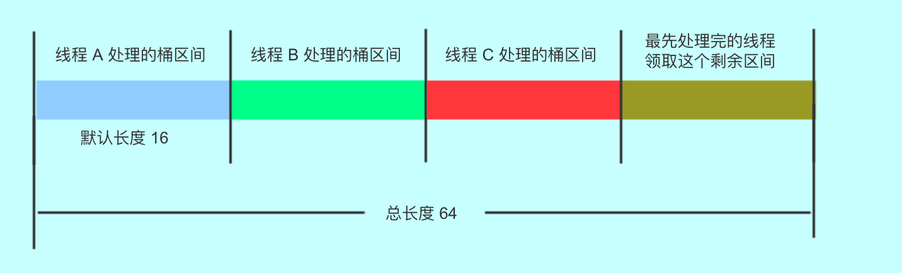
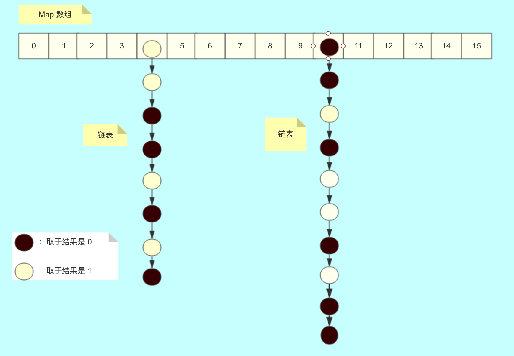

# ConcurrentHashMap(JDK8)

## 提纲
> * 添加流程 put
> * 扩容流程 transfer
> * 并发安全的保证 synchronized & CAS 
> * 总结

## 添加流程 put
ConncurrentHashMap的添加流程主要分为以下几步：

### 添加流程概括
1. 计算新加入键的hash值，进入自旋；
2. 检查hash表（数组）是否初始化（是否为null），没有则CAS加锁进行初始化，其他进程让出资源（Thread.yield()）；
3. 检查hash值对应的桶（head头节点）
    1. 没有初始化则CAS加锁进行将新键值对封装插入，插入成功退出自旋；
    2. 正在扩容，协助扩容，扩容成功继续自旋来到步骤2；
    3. 正常情况，synchronized加锁添加或替换原节点的值，插入成功，检查桶是否需要“树化”，最后退出自旋；
4. 更新Hash表元素的大小值并检查是否需要扩容；


### 添加流程代码注释
```
    final V putVal(K key, V value, boolean onlyIfAbsent) {
        //不允许键值任意一个为null
        if (key == null || value == null) throw new NullPointerException();
        //计算key的hash值
        int hash = spread(key.hashCode());
        //记录桶中的节点数（只有是链表的情况下才会记录）
        int binCount = 0;
        //进入自旋
        for (Node<K,V>[] tab = table;;) {
            // f：对应桶位的头节点
            // n：当前hash表数组的大小
            // i：hash值对应桶位在hash表中的的下标
            // fh：桶节点的hash值
            Node<K,V> f; int n, i, fh;
            if (tab == null || (n = tab.length) == 0)
                // hash表没有经过初始化，则进行初始化
                tab = initTable();
            else if ((f = tabAt(tab, i = (n - 1) & hash)) == null) {
                // 改变桶位的头节点 CAS(NULL -> newNode)
                if (casTabAt(tab, i, null,
                             new Node<K,V>(hash, key, value, null)))
                    // 退出自旋
                    break;
            }
            else if ((fh = f.hash) == MOVED)
                // 桶节点被替换成来特殊节点ForwardNode，对应的hash值是MOVED(-2)
                // 此时帮助一起进行扩容迁移旧hash表中的数据
                tab = helpTransfer(tab, f);
            else {
                // 此时表示桶位已经有元素，并且没有在扩容
                V oldVal = null;
                synchronized (f) {
                    // 二次检查加锁完后是否锁对来，如果没有锁到桶的头节点是无效的
                    if (tabAt(tab, i) == f) {
                        // 桶头的hash值大于0表示当前桶是由链表组成
                        if (fh >= 0) {
                            binCount = 1;
                            // 遍历桶链表
                            for (Node<K,V> e = f;; ++binCount) {
                                K ek;
                                if (e.hash == hash &&
                                    ((ek = e.key) == key ||
                                     (ek != null && key.equals(ek)))) {
                                    //如果有key值相同的节点存在，则替换value值
                                    oldVal = e.val;
                                    if (!onlyIfAbsent)
                                        e.val = value;
                                    break;
                                }
                                Node<K,V> pred = e;
                                if ((e = e.next) == null) {
                                    //如果已经遍历到来“尾巴”节点
                                    //则新创建一个节点插入到“尾巴”节点的后面
                                    pred.next = new Node<K,V>(hash, key,
                                                              value, null);
                                    break;
                                }
                            }
                        }
                        // 通头hash值小于0且是TreeBin，表示当前桶由红黑树组成
                        else if (f instanceof TreeBin) {
                            Node<K,V> p;
                            binCount = 2;
                            // 向树添加节点，如果返回的不为null说明已经存在相同key的节点
                            if ((p = ((TreeBin<K,V>)f).putTreeVal(hash, key,
                                                           value)) != null) {
                                // 存在相同key的节点则替换节点的值
                                oldVal = p.val;
                                if (!onlyIfAbsent)
                                    p.val = value;
                            }
                        }
                    }
                }
                // binCount != 0代表当前的桶是由链表组成
                if (binCount != 0) {
                    // 如果桶中链表元素的个数超过8个则将桶“树化”
                    if (binCount >= TREEIFY_THRESHOLD)
                        treeifyBin(tab, i);
                    if (oldVal != null)
                        return oldVal;
                    break;
                }
            }
        }
        // 刷新桶的大小，并且检查是否需要扩容
        addCount(1L, binCount);
        return null;
    }
```
注意点：

* 桶的**头节点**可以理解为代表整个桶链表（或者树），有点类似C中的数组，首地址可以代表头元素也可以代表整个数组；
* 对桶的操作都会用synchronized进行加锁（除了初始化那次从无到有）
* 桶中的链表元素达到一定个数时会被转换成树来提高效率；
* 在扩容时以及初始化时会进行自旋；

## 扩容流程 transfer

### 扩容流程概括
1. 通过计算 CPU 核心数和 Map 数组的长度得到每个线程（CPU）要帮助处理多少个桶，并且这里每个线程处理都是平均的。默认每个线程处理 16 个桶。因此，如果长度是 16 的时候，扩容的时候只会有一个线程扩容；
2. 初始化临时变量`nextTable`，也就是原有基础上扩容两倍的新hash表。初始化`transferIndex`扩容的起点；
3. 开始自旋，根据一个 finishing 变量来判断，该变量为 true 表示扩容结束，否则继续扩容。（此阶段开始兼容多线程，允许多线程进入自旋）
    1. 分配hash表数组中一个区间的桶给线程，默认是16个。 从旧hash表的末尾向前反向分配进行迁移。当拿到分配完后，进行`i--`递减。这个`i`就是当前线程正在处理迁移的桶下标。（`bound`变量指的是该线程此次处理的区间的结尾下表，超过这个下标说明当前分配的桶已经全部完成迁移，此时如果还未完成扩容就需要重新领取区间;`advance`变量指的是是否继续递减转移下一个桶，true表示可以向前推进继续迁移)
    2. 分配完成后检查当前是否分配到了迁移桶任务，
        1. 检查如果没有分配到桶，则退出方法等待其他线程来迁移；
        2. 检查如果分配的桶全部都迁移完了，则继续循环领任务；
        3. 如果发现迁移工作全部完成并且自己是最后一个完成迁移任务的则将`nextTable`赋值为新的hash表，并且退出方法；
    3. 如果分配到桶线程还没有完成迁移工作；
        1. 迁移桶位为`null`，则标记为`ForwardingNode`告诉其它线程的`putVal`方法当前桶已经在迁移或者已经迁移完了，别再往这里插入数据了，这个旧hash表将要被废弃了；
        2. 迁移桶位为`ForwardingNode`，表示其它线程正在或已经迁移了这个桶位的数据了；（不太明白什么情况下会出现）
        3. 迁移桶位为正常数据，分链表和树两种情况加锁将桶中的数据copy到`nextTable`临时新表当中
    
### 扩容流程代码注释
```
    private final void transfer(Node<K,V>[] tab, Node<K,V>[] nextTab) {
        // n：将被迁移的旧表的长度
        // stride：单线程迁移的步长区间
        int n = tab.length, stride;
        if ((stride = (NCPU > 1) ? (n >>> 3) / NCPU : n) < MIN_TRANSFER_STRIDE)
            // 最小区间16，小于16时交给一个线程处理，其它线程等待
            stride = MIN_TRANSFER_STRIDE;
        // 初始化扩容用的变量，nextTab由调用出CAS控制只可能有一个线程传null
        // 确保但线程的初始化过程，避免重复初始化
        if (nextTab == null) {
            try {
                Node<K,V>[] nt = (Node<K,V>[])new Node<?,?>[n << 1];
                nextTab = nt;
            } catch (Throwable ex) {
                sizeCtl = Integer.MAX_VALUE;
                return;
            }
            // 初始化新hash表数组
            nextTable = nextTab;
            // 初始化扩容迁移的任务其实点，从后向前迁移copy
            transferIndex = n;
        }
        int nextn = nextTab.length;
        // 占位用的节点，用来让其它线程知道当前的hash表正在迁移
        ForwardingNode<K,V> fwd = new ForwardingNode<K,V>(nextTab);
        // 表示线程分配的区间是否迁移结束的标志位，true代表迁移未结束
        boolean advance = true;
        // 表示整个hash表是否迁移结束的的标志位
        boolean finishing = false; 
        // 自旋 
        for (int i = 0, bound = 0;;) {
            Node<K,V> f; int fh;
            while (advance) {
                // nextIndex：代表下次开始分配的桶位的临时变量，确定后会别赋值给transferIndex
                // nextBound：当前线程分配的桶区间的结尾临时变量，最终值会被赋值给bound变量
                int nextIndex, nextBound;
                //i：代表当前迁移桶的位置，向前迁移如果还没有达到结尾且迁移流程没有结束
                if (--i >= bound || finishing)
                    // 标记false让线程继续进行迁移工作
                    advance = false;
                else if ((nextIndex = transferIndex) <= 0) {
                    // 表示迁移到末尾，标记false让线程做一些收尾工作
                    i = -1;
                    advance = false;
                }
                //CAS加锁保证线程能正确分配到指定步长（stride）的桶
                else if (U.compareAndSwapInt
                         (this, TRANSFERINDEX, nextIndex,
                          nextBound = (nextIndex > stride ?
                                       nextIndex - stride : 0))) {
                    //分配成功，设置迁移工作的起始点i，结束点bound，以及advance标志位
                    bound = nextBound;
                    i = nextIndex - 1;
                    advance = false;
                }
            }
            // 代表当前线程分配到的迁移工作结束了
            if (i < 0 || i >= n || i + n >= nextn) {
                int sc;
                // 如果整个迁移任务结束了
                if (finishing) {
                    // 置空全局变量
                    nextTable = null;
                    // 将迁移好的新表临时变量赋值给table变量
                    table = nextTab;
                    // 设置新表的阈值为最大容量的0.75（老表长度*2 — 老表长度*0.5）
                    sizeCtl = (n << 1) - (n >>> 1);
                    return;
                }
                // 当前线程处理迁移工作结束，标记sizeCtl记录的迁移线程数-1
                if (U.compareAndSwapInt(this, SIZECTL, sc = sizeCtl, sc - 1)) {
                    // sc还是上面-1前的线程数，-2后和RESIZE_STAMP_SHIFT对比
                    // 如果相同说明没有线程在迁移了，自己是最后一个了，如果不同说明
                    // 还有线程正在处理迁移
                    if ((sc - 2) != resizeStamp(n) << RESIZE_STAMP_SHIFT)
                        //处理完成退出方法
                        return;
                    // 如果自己是最后一个处理完成的线程则标记finishing说明已经结束了
                    finishing = advance = true;
                    // 赋值保证下次自旋后还能进入之前的if判断来接着完成收尾工作
                    i = n;
                }
            }
            else if ((f = tabAt(tab, i)) == null)
                // 在迁移过程中，如果当前桶位为null，标记为ForwardNode
                advance = casTabAt(tab, i, null, fwd);
            else if ((fh = f.hash) == MOVED)
                // 在迁移过程中，如果当前桶位为ForwardNode，则跳过
                advance = true;
            else {
                // 当前桶位有正常数据，加锁进行迁移
                synchronized (f) {
                    if (tabAt(tab, i) == f) {
                        Node<K,V> ln, hn;
                        // 桶为链表的情况
                        if (fh >= 0) {
                            int runBit = fh & n;
                            Node<K,V> lastRun = f;
                            for (Node<K,V> p = f.next; p != null; p = p.next) {
                                int b = p.hash & n;
                                if (b != runBit) {
                                    runBit = b;
                                    lastRun = p;
                                }
                            }
                            // 下面这个if else块没搞明白，难道是只有一个元素的时候？
                            if (runBit == 0) {
                                ln = lastRun;
                                hn = null;
                            }
                            else {
                                hn = lastRun;
                                ln = null;
                            }
                            //遍历桶位中的元素
                            for (Node<K,V> p = f; p != lastRun; p = p.next) {
                                int ph = p.hash; K pk = p.key; V pv = p.val;
                                
                                if ((ph & n) == 0)
                                    //表示当前hash对应的节点取余数是表长的双数倍
                                    ln = new Node<K,V>(ph, pk, pv, ln);
                                else
                                    //表示当前hash对应的节点取余数是表长的单数倍
                                    hn = new Node<K,V>(ph, pk, pv, hn);
                            }
                            // 将双数倍的节点放在新链表的低n位的桶中
                            setTabAt(nextTab, i, ln);
                            // 将单数倍的节点放在新链表的高n位的桶位中
                            setTabAt(nextTab, i + n, hn);
                            // 标记迁移成功设置位ForwardNode占位节点
                            setTabAt(tab, i, fwd);
                            advance = true;
                        }
                        // 桶为红黑树的情况，插入类似不再注释
                        else if (f instanceof TreeBin) {
                            TreeBin<K,V> t = (TreeBin<K,V>)f;
                            TreeNode<K,V> lo = null, loTail = null;
                            TreeNode<K,V> hi = null, hiTail = null;
                            int lc = 0, hc = 0;
                            for (Node<K,V> e = t.first; e != null; e = e.next) {
                                int h = e.hash;
                                TreeNode<K,V> p = new TreeNode<K,V>
                                    (h, e.key, e.val, null, null);
                                if ((h & n) == 0) {
                                    if ((p.prev = loTail) == null)
                                        lo = p;
                                    else
                                        loTail.next = p;
                                    loTail = p;
                                    ++lc;
                                }
                                else {
                                    if ((p.prev = hiTail) == null)
                                        hi = p;
                                    else
                                        hiTail.next = p;
                                    hiTail = p;
                                    ++hc;
                                }
                            }
                            ln = (lc <= UNTREEIFY_THRESHOLD) ? untreeify(lo) :
                                (hc != 0) ? new TreeBin<K,V>(lo) : t;
                            hn = (hc <= UNTREEIFY_THRESHOLD) ? untreeify(hi) :
                                (lc != 0) ? new TreeBin<K,V>(hi) : t;
                            setTabAt(nextTab, i, ln);
                            setTabAt(nextTab, i + n, hn);
                            setTabAt(tab, i, fwd);
                            advance = true;
                        }
                    }
                }
            }
        }
    }
```

### 并发扩容
ConcurrentHashMap支持并发扩容，实现方式是，将表拆分，让每个线程处理自己的区间。如下图



假设总长度是 64 ，每个线程可以分到 16 个桶，各自处理，不会互相影响。

### 桶的迁移
每个线程桶迁移是假设如下图：



假设10号位要开始迁移，这个时候会将10号位的链表拆成两个链表，一个是16的双数倍数的链表，一个是16单数倍数的链表；

16的双数倍数的链表一定也能被32整除而且余数一样，因此被拆出来的双数位链表也就是`(ph & n) == 0`的这部分节点组成的链因为取余和32是一样的就移动到对应的新链表相同的位置也就是新链表下标为10的位置上去；

16的单数倍数的链表能被16整出去余数，但是和被32整除取余数相比余数刚好相差了16，因此这部分链表会被移动到高位也就是10+16，新链表26下标的位置上去；

### sizeCtl
sizeCtl变量在不通阶段的含义是不同的

#### 初始化
值为-1，代表当前正在有线程进行表的初始化工作

#### 正常情况
值为当前ConcurrentHashMap中hash表的最大阈值，也就是表长的0.75；

#### 扩容阶段
前16为代表本次扩容的标志位一般为1开头也就是整体是负数，后16为代表本次并发参与扩容的线程数，从1开始计数；


## 并发安全的保证 synchronized & CAS 
ConcurrentHashMap通过CAS和synchronized关键字来保证并发时的线程安全，并且实现了在高并发的情况下效率也非常的高，原因是ConcurrentHashMap在并发时通过CAS来保证状态值的安全，通过Synchronized来保证桶的安全，将锁粒度给细化了；

### CAS
ConcurrentHashMap用到CAS来保护并发线程安全的情况如下：

* 创建桶位，也就是桶的头节点，从无到有的过程
* 修改sizeCtl状态时（标记扩容状态，记录修改扩容并发线程数，修改map容量）
* 修改transferIndex处理进度下标时
* 扩容新表的初始化，从无到有的过程

可以总结CAS一般都是为了保证一些变量的但状态改变，在多线程并发的情况下，只允许单一线程改变这个变量，这个变量的特点就是只有从一个状态变到另外一个状态，不涉及到多状态同时发生变化；

### Synchronized
ConcurrentHashMap用到Synchronized来保护并发线程安全的情况只有在操作对应桶位的时候才会用到，如添加元素到已经存在的桶位中，如扩容将已经存在的桶位复制到新hash表中；

一般这些情况都涉及到整个桶对应的链表（或者树）状态的记录，保证这整个链表（树）操作的原子性，如果用CAS来实现会非常复杂，需要变化前所有节点的状态，以及变化后预期的所有节点变化的状态，可以说基本不能实现；因此这里采用了Synchronzed来对整个桶链表（树）来加锁进行操作；

### 自旋锁
ConcurrentHashMap中多处用到自旋锁，如帮助扩容时，正在初始化时，都采用CAS加自旋的方式去轮询，短时间的不阻塞唤醒线程来提交并发时的效率；


## 参考资料
并发编程——ConcurrentHashMap#transfer() 扩容逐行分析
https://juejin.im/post/5b00160151882565bd2582e0